# LiveKit Video Conference - Complete Call Flow Documentation

## Overview

This document describes the end-to-end call flow in the LiveKit video conference system, from call initiation to successful connection between users. The system consists of:

- **Backend**: Golang server handling authentication, call management, and signaling
- **LiveKit Server**: Media relay and WebRTC infrastructure
- **Client**: Browser/mobile application using LiveKit SDK

---

## Architecture Overview

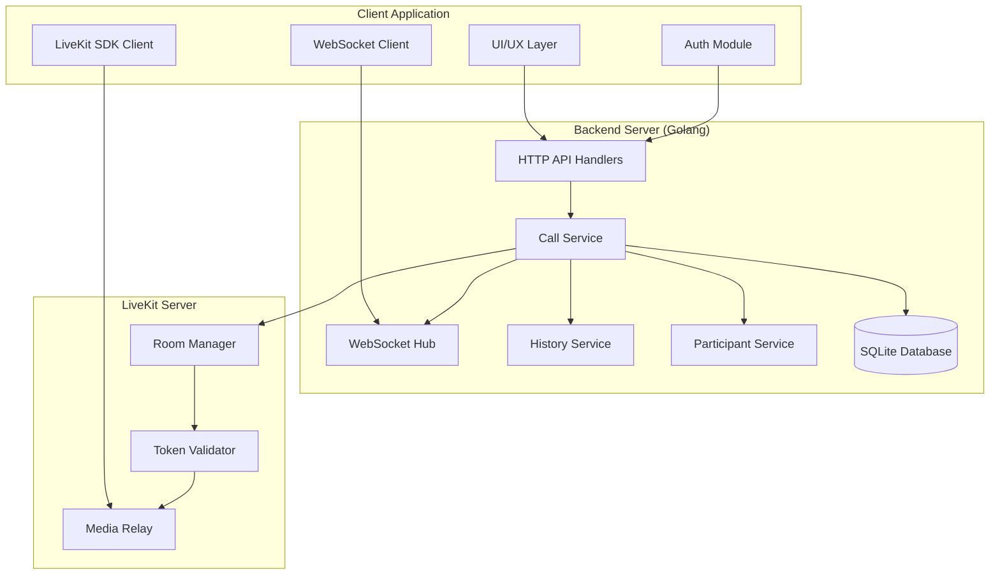

---

## Complete E2E Call Flow Sequence

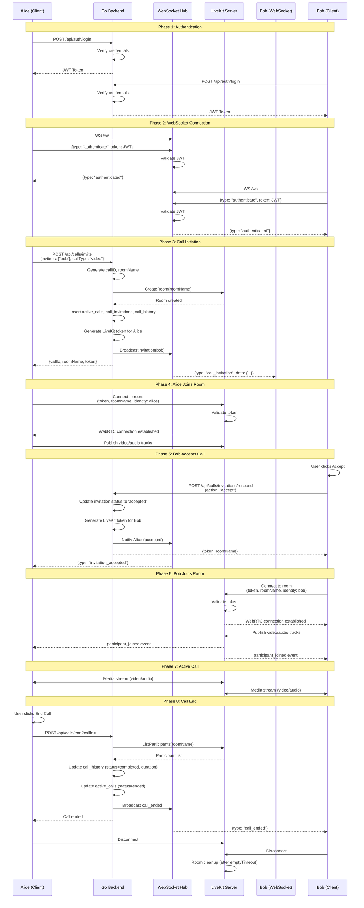

---

## Detailed Flow by Phase

### Phase 1: User Authentication

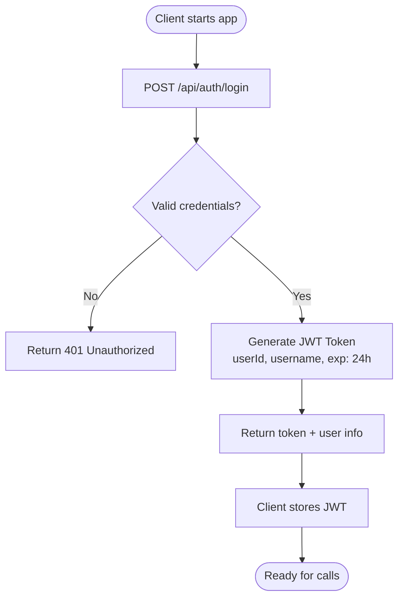

**Key Components:**
- Handler: `HandleLogin` in `livekit/handlers/auth_handlers.go`
- Service: Password verification using bcrypt
- Database: Query `users` table
- Token: HS256 signed JWT with 24-hour expiry

---

### Phase 2: Call Initiation (Caller Side)

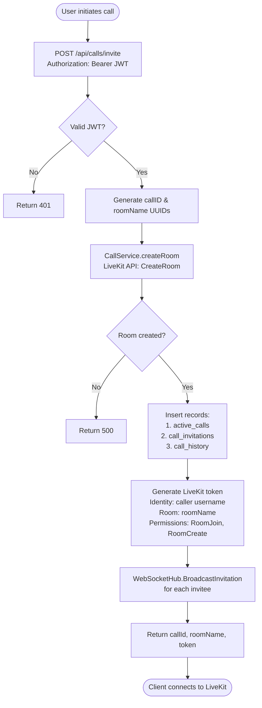

**Database Operations:**

```sql
-- 1. Create active call
INSERT INTO active_calls (call_id, room_name, call_type, created_by, status, created_at)
VALUES ('uuid1', 'uuid2', 'video', 123, 'active', NOW());

-- 2. Create invitation for each invitee
INSERT INTO call_invitations (call_id, inviter_id, invitee_id, call_type, room_name, status, created_at)
VALUES ('uuid1', 123, 456, 'video', 'uuid2', 'pending', NOW());

-- 3. Create history record
INSERT INTO call_history (call_id, room_name, call_type, created_by, participants, started_at, status)
VALUES ('uuid1', 'uuid2', 'video', 123, '["alice", "bob"]', NOW(), 'pending');
```

**LiveKit Token Claims:**

```json
{
  "video": {
    "roomJoin": true,
    "roomCreate": true,
    "room": "uuid2",
    "canPublish": true,
    "canPublishData": true
  },
  "identity": "alice",
  "exp": 1640000000
}
```

---

### Phase 3: Invitation Reception (Callee Side)

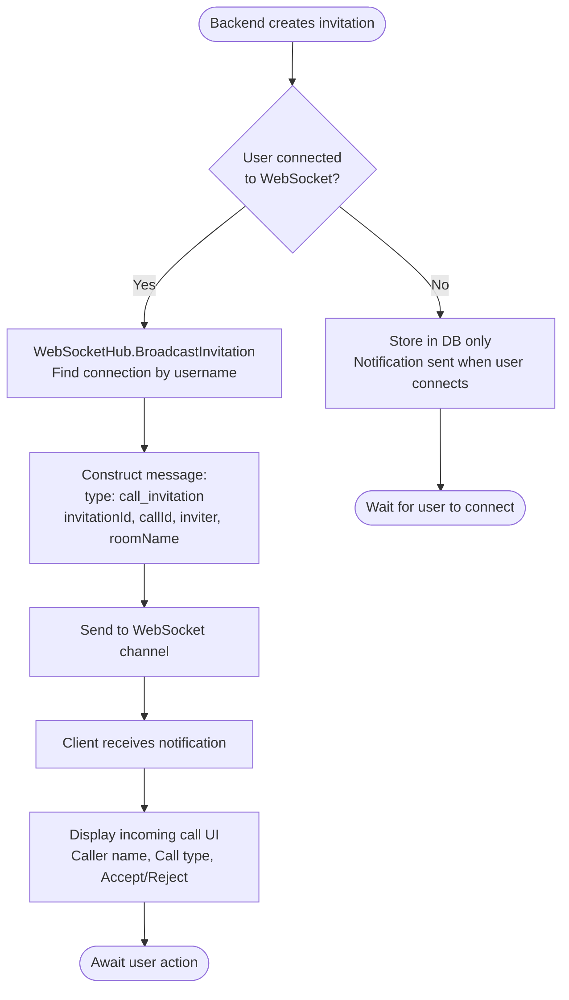

**WebSocket Message Format:**

```json
{
  "type": "call_invitation",
  "data": {
    "invitationId": 123,
    "callId": "uuid1",
    "inviter": "alice",
    "callType": "video",
    "roomName": "uuid2",
    "createdAt": "2026-01-08T12:00:00Z"
  }
}
```

---

### Phase 4: Invitation Response

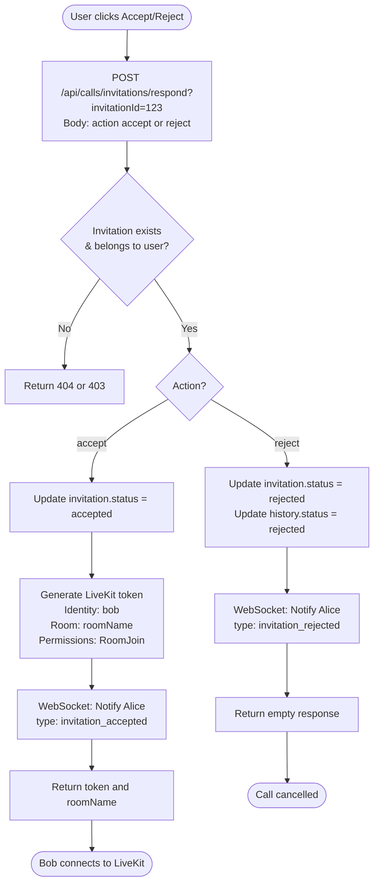

**Accept Response:**

```json
{
  "token": "eyJhbGciOiJIUzI1NiIsInR5cCI6IkpXVCJ9...",
  "roomName": "uuid2"
}
```

**WebSocket Notifications:**

```json
// To caller when accepted
{
  "type": "invitation_accepted",
  "data": {
    "callId": "uuid1",
    "invitee": "bob"
  }
}

// To caller when rejected
{
  "type": "invitation_rejected",
  "data": {
    "callId": "uuid1",
    "invitee": "bob"
  }
}
```

---

### Phase 5: LiveKit Connection

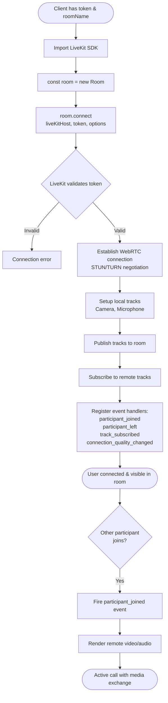

**Client-Side Code (Pseudo):**

```javascript
import { Room } from 'livekit-client';

// After receiving token and roomName from backend
const room = new Room({
  adaptiveStream: true,
  dynacast: true
});

// Event handlers
room.on('participant_joined', (participant) => {
  console.log('Participant joined:', participant.identity);
  renderParticipant(participant);
});

room.on('track_subscribed', (track, publication, participant) => {
  if (track.kind === 'video') {
    attachVideoTrack(track, participant);
  } else if (track.kind === 'audio') {
    attachAudioTrack(track, participant);
  }
});

// Connect to room
await room.connect(liveKitHost, token, {
  name: roomName,
  identity: username
});

// Publish local tracks
await room.localParticipant.enableCameraAndMicrophone();
```

**LiveKit Protocol Flow:**

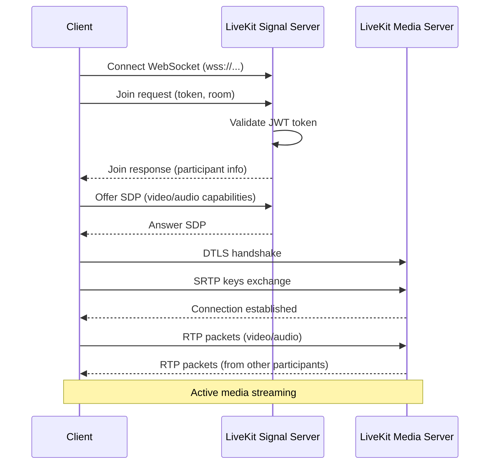

---

### Phase 6: Active Call State

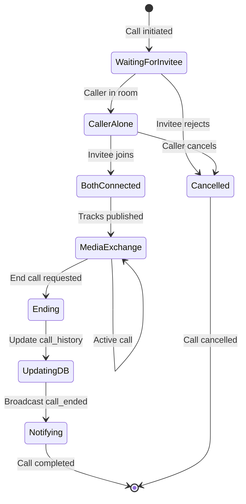

**State Tracking:**

| State | active_calls.status | call_invitations.status | call_history.status |
|-------|---------------------|-------------------------|---------------------|
| Created | active | pending | pending |
| Accepted | active | accepted | pending |
| Rejected | active | rejected | rejected |
| In Progress | active | accepted | pending |
| Ended | ended | accepted | completed |
| Cancelled | cancelled | cancelled | cancelled |

---

### Phase 7: Call Termination

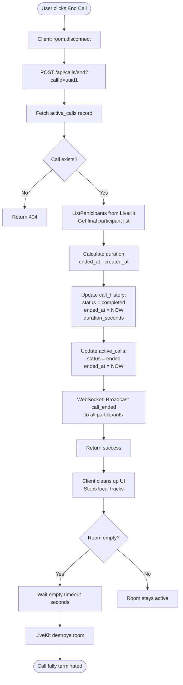

**Database Updates:**

```sql
-- Update call history
UPDATE call_history
SET status = 'completed',
    ended_at = NOW(),
    duration_seconds = TIMESTAMPDIFF(SECOND, started_at, NOW())
WHERE call_id = 'uuid1';

-- Update active calls
UPDATE active_calls
SET status = 'ended',
    ended_at = NOW()
WHERE call_id = 'uuid1';
```

**WebSocket Notification:**

```json
{
  "type": "call_ended",
  "data": {
    "callId": "uuid1",
    "endedBy": "alice",
    "duration": 180
  }
}
```

---

## API Endpoints Reference

### Authentication

| Method | Endpoint | Description | Request | Response |
|--------|----------|-------------|---------|----------|
| POST | `/api/auth/register` | Register new user | `{username, password}` | `{token, user}` |
| POST | `/api/auth/login` | Login user | `{username, password}` | `{token, user}` |
| GET | `/api/auth/me` | Get current user | - | `{user}` |

### Call Management

| Method | Endpoint | Description | Request | Response |
|--------|----------|-------------|---------|----------|
| POST | `/api/calls/invite` | Initiate call | `{invitees: [usernames], callType}` | `{callId, roomName, token}` |
| GET | `/api/calls/invitations` | Get pending invitations | - | `[{invitation}]` |
| POST | `/api/calls/invitations/respond` | Accept/reject invitation | `{action: "accept" or "reject"}` | `{token, roomName}` |
| POST | `/api/calls/end` | End active call | `?callId=uuid` | `{success}` |
| POST | `/api/calls/cancel` | Cancel pending call | `?callId=uuid` | `{success}` |

### Token Generation

| Method | Endpoint | Description | Request | Response |
|--------|----------|-------------|---------|----------|
| POST | `/api/token` | Generate LiveKit token | `{roomName, participantName}` | `{token}` |

### WebSocket

| Protocol | Endpoint | Description |
|----------|----------|-------------|
| WS | `/ws` | WebSocket connection for real-time notifications |

---

## WebSocket Message Types

### Client → Server

| Type | Description | Payload |
|------|-------------|---------|
| `authenticate` | Authenticate WebSocket connection | `{token: "JWT"}` |
| `ping` | Keep-alive ping | `{}` |

### Server → Client

| Type | Description | Payload |
|------|-------------|---------|
| `authenticated` | Authentication success | `{}` |
| `pong` | Keep-alive pong | `{}` |
| `call_invitation` | Incoming call notification | `{invitationId, callId, inviter, callType, roomName}` |
| `invitation_accepted` | Invitee accepted call | `{callId, invitee}` |
| `invitation_rejected` | Invitee rejected call | `{callId, invitee}` |
| `call_ended` | Call was ended | `{callId, endedBy, duration}` |
| `call_cancelled` | Call was cancelled | `{callId}` |

---

## Database Schema

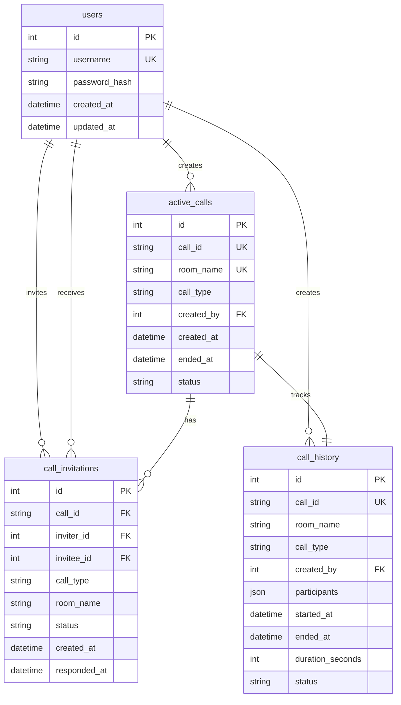

---

## Configuration

### Environment Variables

```bash
# LiveKit Server Configuration
LIVEKIT_HOST=http://localhost:7880           # LiveKit server address
LIVEKIT_API_KEY=your-api-key                 # API key for LiveKit
LIVEKIT_API_SECRET=your-api-secret           # API secret for LiveKit

# Backend Server
SERVER_PORT=8080                              # Backend server port
JWT_SECRET=your-secret-key                    # JWT signing secret

# Database
DB_PATH=vidconf.db                            # SQLite database file path

# Room Configuration
ROOM_EMPTY_TIMEOUT=300                        # Seconds before destroying empty room
ROOM_MAX_PARTICIPANTS=20                      # Max participants per room
```

---

## Security Considerations

### JWT Tokens

1. **Backend JWT (HTTP API)**
   - Algorithm: HS256
   - Expiry: 24 hours
   - Claims: userId, username
   - Used for: HTTP request authentication

2. **LiveKit JWT (Media Connection)**
   - Algorithm: HS256 (signed with LIVEKIT_API_SECRET)
   - Expiry: 24 hours
   - Claims: video permissions, room name, identity
   - Used for: WebRTC connection authentication

### Authorization

- All HTTP endpoints (except `/auth/*` and `/health`) require valid JWT in `Authorization: Bearer` header
- WebSocket connections require authentication message with valid JWT
- LiveKit tokens are scoped to specific rooms and identities
- Room names are UUIDs to prevent enumeration attacks

### Data Validation

- Username uniqueness enforced at database level
- Invitation responses validated against invitee user ID
- Call end requests validated against active_calls records
- Password hashing using bcrypt with appropriate cost factor

---

## Error Handling

### Common HTTP Error Codes

| Code | Description | Scenarios |
|------|-------------|-----------|
| 400 | Bad Request | Invalid JSON, missing required fields |
| 401 | Unauthorized | Invalid/expired JWT, authentication failed |
| 403 | Forbidden | User not allowed to perform action |
| 404 | Not Found | Call/invitation/user not found |
| 409 | Conflict | Username already exists |
| 500 | Internal Server Error | Database errors, LiveKit connection failures |

### WebSocket Error Handling

- Connection failures: Auto-reconnect with exponential backoff (client-side)
- Invalid messages: Logged but connection not terminated
- Authentication failures: Connection closed with error message

---

## Performance Considerations

### Database

- Indexes on: `username`, `call_id`, `room_name`, `status` columns
- SQLite with WAL mode for concurrent reads
- Connection pooling for database access

### WebSocket

- Buffered channels (256 entries) for outbound messages
- Separate goroutines for read/write operations per connection
- Automatic cleanup of stale connections

### LiveKit

- Room reuse when possible (409 Conflict handling)
- Automatic room cleanup with `emptyTimeout`
- Token caching not implemented (tokens are short-lived)

---

## Example: Complete Call Flow Timeline

### Scenario: Alice calls Bob for a video chat

**T=0s: Alice initiates call**
```
POST /api/calls/invite
{
  "invitees": ["bob"],
  "callType": "video"
}

Backend:
1. Generates callID: "a1b2c3d4-..."
2. Generates roomName: "e5f6g7h8-..."
3. Creates LiveKit room "e5f6g7h8-..."
4. Inserts into active_calls, call_invitations, call_history
5. Generates token for Alice
6. Broadcasts invitation to Bob via WebSocket

Response to Alice:
{
  "callId": "a1b2c3d4-...",
  "roomName": "e5f6g7h8-...",
  "token": "eyJhbGci..."
}
```

**T=1s: Alice joins LiveKit room**
```javascript
await room.connect('http://localhost:7880', token, {
  name: 'e5f6g7h8-...',
  identity: 'alice'
});
await room.localParticipant.enableCameraAndMicrophone();
```

**T=2s: Bob receives WebSocket notification**
```json
{
  "type": "call_invitation",
  "data": {
    "invitationId": 123,
    "callId": "a1b2c3d4-...",
    "inviter": "alice",
    "callType": "video",
    "roomName": "e5f6g7h8-..."
  }
}
```

**T=5s: Bob accepts call**
```
POST /api/calls/invitations/respond?invitationId=123
{
  "action": "accept"
}

Backend:
1. Updates call_invitations.status = 'accepted'
2. Generates token for Bob
3. Sends WebSocket to Alice: {type: "invitation_accepted"}

Response to Bob:
{
  "token": "eyJhbGci...",
  "roomName": "e5f6g7h8-..."
}
```

**T=6s: Bob joins LiveKit room**
```javascript
await room.connect('http://localhost:7880', token, {
  name: 'e5f6g7h8-...',
  identity: 'bob'
});
await room.localParticipant.enableCameraAndMicrophone();
```

**T=6.5s: Both users see each other**
- Alice receives `participant_joined` event for Bob
- Bob receives `participant_joined` event for Alice
- Both render remote video/audio streams
- **Call is now active**

**T=180s: Alice ends call**
```
POST /api/calls/end?callId=a1b2c3d4-...

Backend:
1. Gets participants from LiveKit
2. Calculates duration: 180 seconds
3. Updates call_history: status='completed', duration=180
4. Updates active_calls: status='ended'
5. Broadcasts {type: "call_ended"} to Bob
```

**T=181s: Both disconnect**
- Alice and Bob close WebRTC connections
- LiveKit room becomes empty
- After 300s (emptyTimeout), LiveKit destroys room

---

## Monitoring & Debugging

### Useful Queries

```sql
-- Active calls
SELECT * FROM active_calls WHERE status = 'active';

-- Call history with participants
SELECT
  ch.call_id,
  ch.room_name,
  u.username as creator,
  ch.participants,
  ch.duration_seconds,
  ch.status
FROM call_history ch
JOIN users u ON ch.created_by = u.id
ORDER BY ch.started_at DESC;

-- Pending invitations
SELECT
  ci.id,
  u1.username as inviter,
  u2.username as invitee,
  ci.call_type,
  ci.created_at
FROM call_invitations ci
JOIN users u1 ON ci.inviter_id = u1.id
JOIN users u2 ON ci.invitee_id = u2.id
WHERE ci.status = 'pending';
```

### Health Check

```bash
curl http://localhost:8080/health
```

Response:
```json
{
  "status": "ok"
}
```

---

## Conclusion

This system provides a complete end-to-end video conferencing solution with:

- **Secure authentication** using JWT tokens
- **Real-time signaling** via WebSocket
- **Call management** with invitation flow
- **Media relay** through LiveKit infrastructure
- **Call history** and analytics
- **Scalable architecture** with clear separation of concerns

The flow ensures that all participants are properly authenticated, invited, and connected before media exchange begins, providing a robust and secure video conferencing experience.
