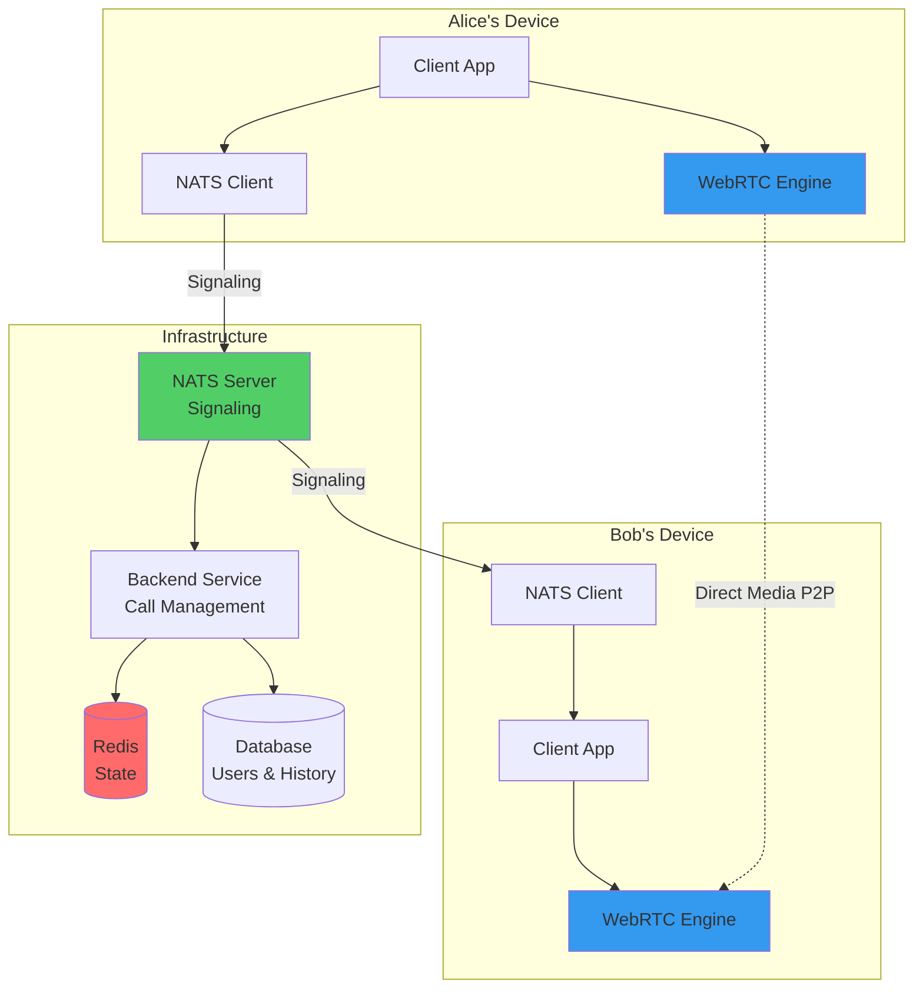
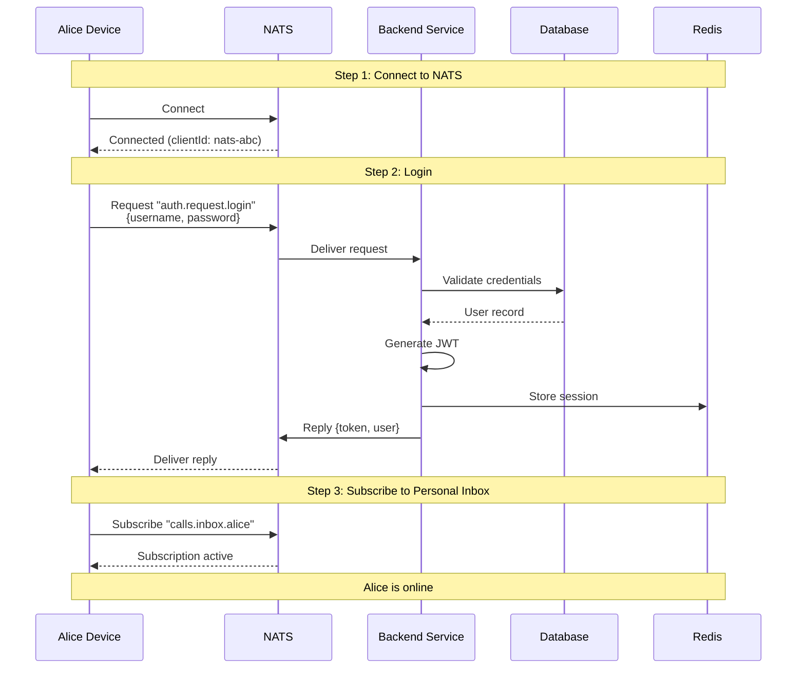
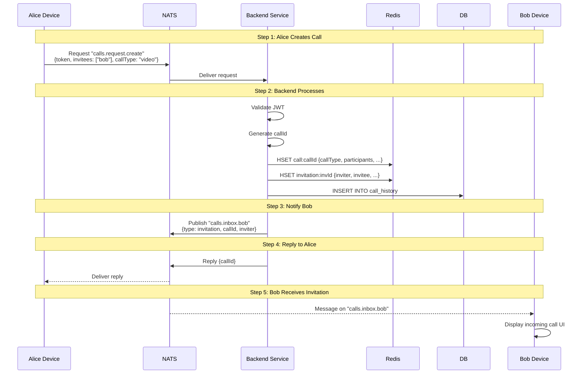
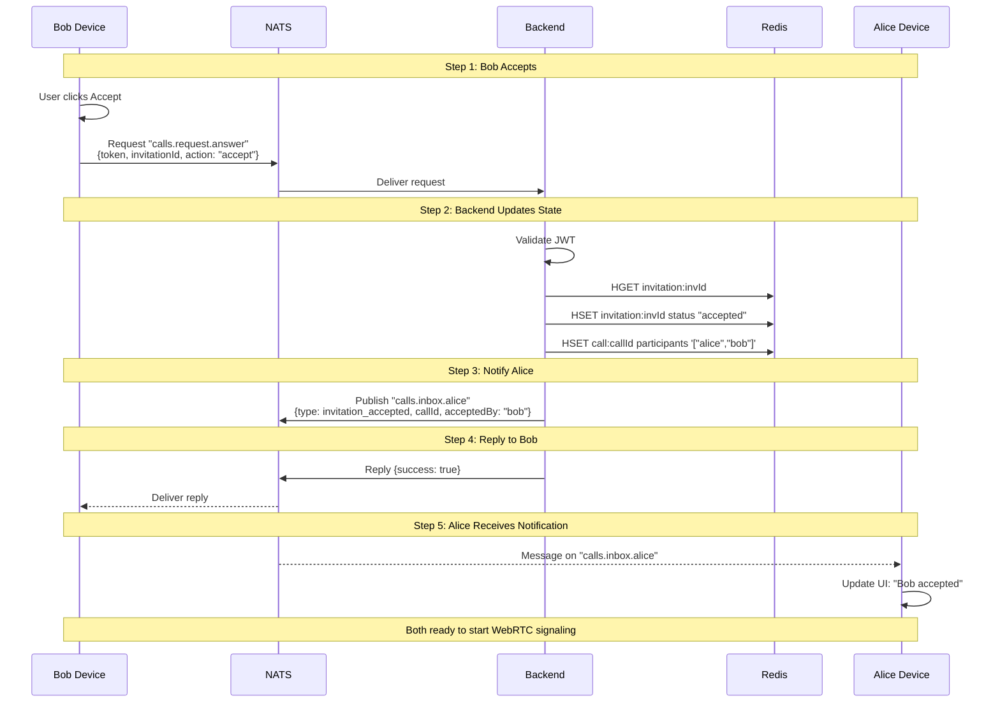
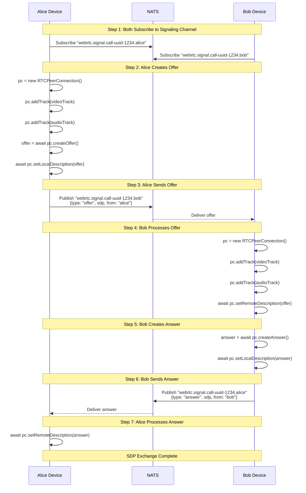
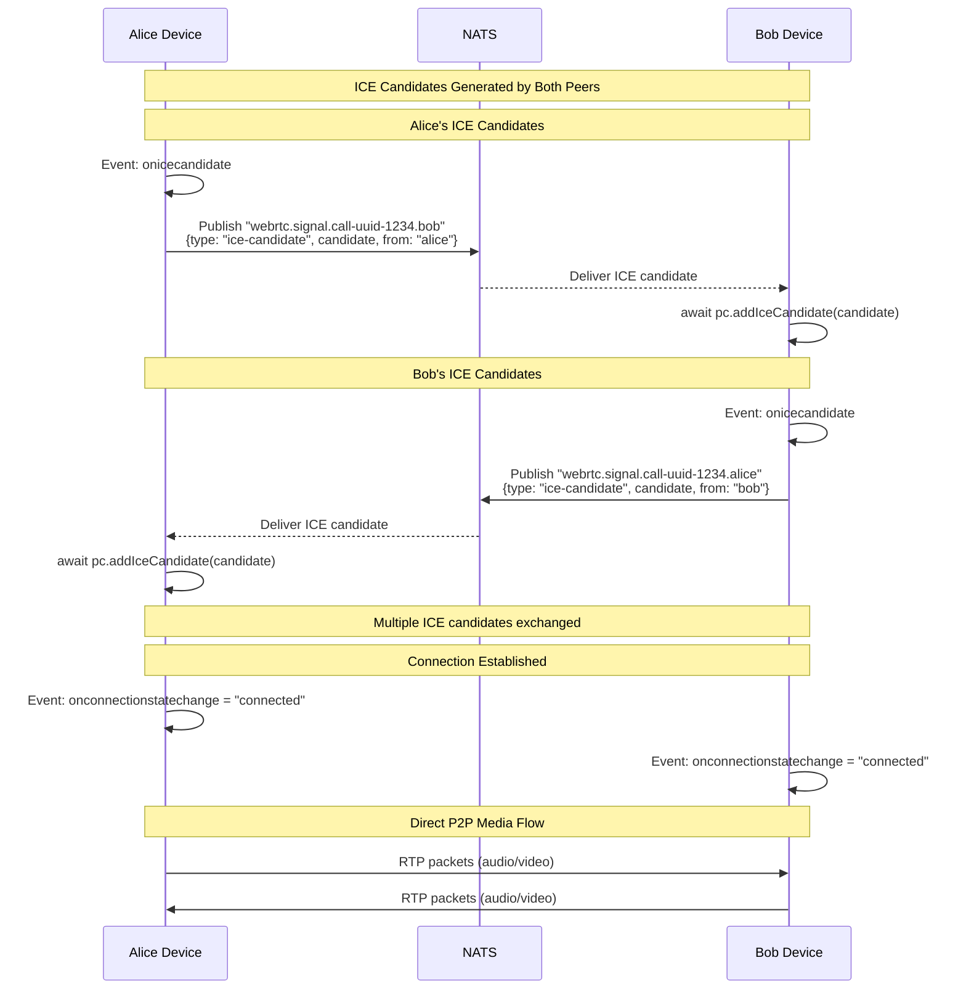
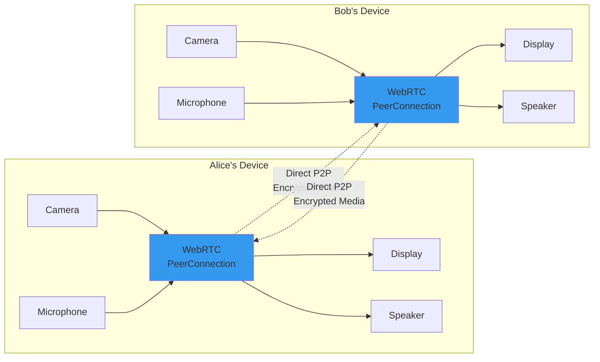
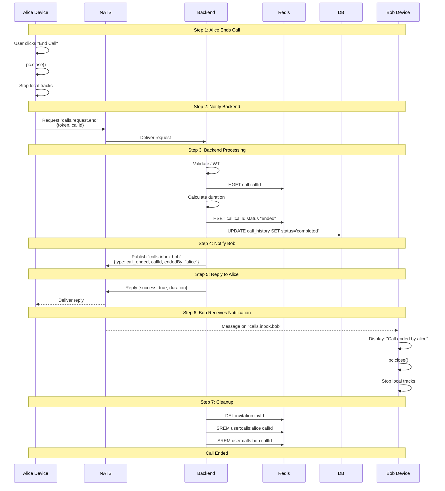
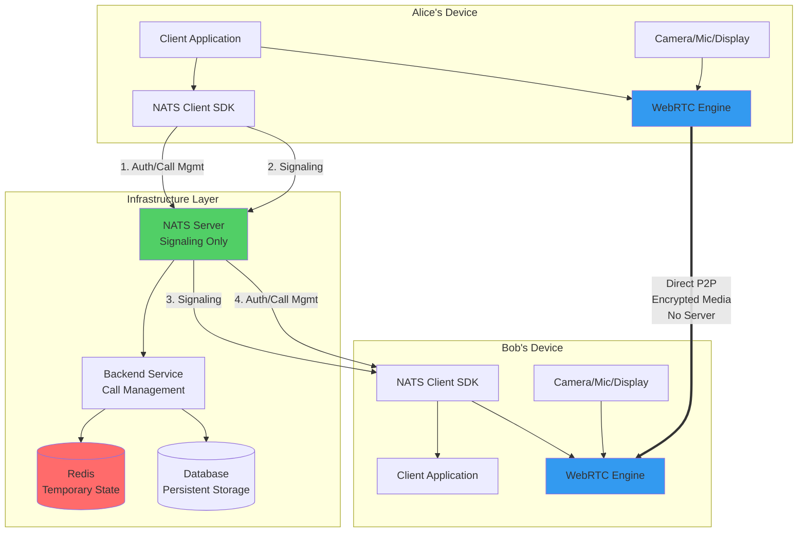

# Pure P2P WebRTC Video Conference - NATS + Redis Architecture

## Overview

This document describes a **pure peer-to-peer (P2P) WebRTC architecture** using:
- **NATS.io**: All signaling and messaging (SDP exchange, ICE candidates, notifications)
- **Redis**: Temporary state storage (calls, invitations, sessions)
- **PostgreSQL/SQLite**: Persistent storage (users, call history)
- **WebRTC**: Direct peer-to-peer media connection between devices

**No Centralized Media Server** - Devices connect directly to each other.

**Architecture**: `Device A ↔ [NATS + Redis] ↔ Device B`

---

## Architecture Principles

### Pure Peer-to-Peer Architecture



---

## NATS Subject Hierarchy

### Request Subjects (Client → Backend)

| Subject | Description | Request Payload | Reply Payload |
|---------|-------------|-----------------|---------------|
| `auth.request.register` | Register new user | `RegisterRequest` | `AuthReply` |
| `auth.request.login` | User login | `LoginRequest` | `AuthReply` |
| `calls.request.create` | Create call | `CreateCallRequest` | `CreateCallReply` |
| `calls.request.answer` | Answer invitation | `AnswerRequest` | `AckReply` |
| `calls.request.reject` | Reject invitation | `RejectRequest` | `AckReply` |
| `calls.request.end` | End call | `EndCallRequest` | `EndCallReply` |

### Personal Inbox Subjects (Backend/Peer → Client)

| Subject Pattern | Description | Payload | Usage |
|----------------|-------------|---------|-------|
| `calls.inbox.{username}` | Personal notifications | `InboxMessage` | Call events, invitations |

### WebRTC Signaling Subjects (Peer → Peer via Backend)

| Subject Pattern | Description | Payload | Usage |
|----------------|-------------|---------|-------|
| `webrtc.signal.{callId}.{username}` | WebRTC signaling | `SignalingMessage` | SDP offers/answers, ICE candidates |

### Subject Hierarchy Tree

```
nats://
│
├── auth.request.>
│   ├── register
│   └── login
│
├── calls.request.>
│   ├── create
│   ├── answer
│   ├── reject
│   └── end
│
├── calls.inbox.>
│   ├── alice
│   └── bob
│
└── webrtc.signal.>
    └── {callId}.>
        ├── alice
        └── bob
```

---

## NATS Message Formats

### Signaling Messages

**SDP Offer**:
```json
{
  "type": "offer",
  "from": "alice",
  "to": "bob",
  "callId": "call-uuid-1234",
  "sdp": "v=0\r\no=- 123456789 2 IN IP4 127.0.0.1\r\n..."
}
```

**SDP Answer**:
```json
{
  "type": "answer",
  "from": "bob",
  "to": "alice",
  "callId": "call-uuid-1234",
  "sdp": "v=0\r\no=- 987654321 2 IN IP4 127.0.0.1\r\n..."
}
```

**ICE Candidate**:
```json
{
  "type": "ice-candidate",
  "from": "alice",
  "to": "bob",
  "callId": "call-uuid-1234",
  "candidate": {
    "candidate": "candidate:1 1 UDP 2130706431 192.168.1.100 54321 typ host",
    "sdpMid": "0",
    "sdpMLineIndex": 0
  }
}
```

---

## Redis Data Structures

### 1. Active Calls (Hash + TTL)

**Key Pattern**: `call:{callId}`

**TTL**: 24 hours

**Structure**:
```json
{
  "callId": "call-uuid-1234",
  "callType": "video",
  "createdBy": "alice",
  "createdByUserId": "123",
  "createdAt": "2026-01-09T10:00:00Z",
  "status": "active",
  "participants": ["alice", "bob"]
}
```

### 2. Call Invitations (Hash + TTL)

**Key Pattern**: `invitation:{invitationId}`

**TTL**: 2 hours

**Structure**:
```json
{
  "invitationId": "inv-uuid-9999",
  "callId": "call-uuid-1234",
  "inviter": "alice",
  "inviterId": "123",
  "invitee": "bob",
  "inviteeId": "456",
  "callType": "video",
  "status": "pending",
  "createdAt": "2026-01-09T10:00:00Z"
}
```

### 3. User Sessions (Hash + TTL)

**Key Pattern**: `session:{userId}`

**TTL**: 24 hours

**Structure**:
```json
{
  "userId": "123",
  "username": "alice",
  "connectedAt": "2026-01-09T09:30:00Z",
  "natsClientId": "nats-client-abc123",
  "status": "online"
}
```

---

## Complete E2E P2P Call Flow

### Phase 1: User Authentication & NATS Connection



**Data Transition 1.1: Login Request**
```
Subject: auth.request.login
Request: {
  "username": "alice",
  "password": "secret123"
}
Reply Inbox: _INBOX.alice001

Reply: {
  "success": true,
  "token": "eyJhbGciOiJIUzI1NiIsInR5cCI6IkpXVCJ9...",
  "user": {
    "id": 123,
    "username": "alice"
  }
}
```

**Data Transition 1.2: Redis Session**
```
Command: HSET session:123 userId "123" username "alice" natsClientId "nats-abc" status "online"
Command: EXPIRE session:123 86400

Result: Session stored with 24-hour TTL
```

**Data Transition 1.3: Subscribe to Inbox**
```
Subject: calls.inbox.alice
Subscription: Active
Purpose: Receive call invitations and notifications
```

---

### Phase 2: Call Initiation (Alice calls Bob)



**Data Transition 2.1: Create Call Request**
```
Subject: calls.request.create
Request: {
  "token": "eyJhbGciOiJIUzI1NiIsInR5cCI6IkpXVCJ9...",
  "invitees": ["bob"],
  "callType": "video"
}

Processing:
1. Validate JWT → userId=123, username="alice"
2. Generate callId: "call-uuid-1234"
3. Generate invitationId: "inv-uuid-9999"
```

**Data Transition 2.2: Redis Storage**
```
Command 1: HSET call:call-uuid-1234 callId "call-uuid-1234" callType "video" createdBy "alice" createdByUserId "123" status "active" participants '["alice"]'
Command 2: EXPIRE call:call-uuid-1234 86400

Command 3: HSET invitation:inv-uuid-9999 invitationId "inv-uuid-9999" callId "call-uuid-1234" inviter "alice" invitee "bob" status "pending"
Command 4: EXPIRE invitation:inv-uuid-9999 7200

Command 5: SADD user:calls:alice "call-uuid-1234"
Command 6: SADD user:invitations:bob "inv-uuid-9999"
```

**Data Transition 2.3: Database Persistence**
```
INSERT INTO call_history (
  call_id,
  call_type,
  created_by,
  participants,
  started_at,
  status
) VALUES (
  'call-uuid-1234',
  'video',
  123,
  '["alice", "bob"]',
  '2026-01-09T10:00:00Z',
  'pending'
);
```

**Data Transition 2.4: Notification to Bob**
```
Subject: calls.inbox.bob
Payload: {
  "type": "invitation",
  "invitationId": "inv-uuid-9999",
  "callId": "call-uuid-1234",
  "inviter": "alice",
  "inviterId": "123",
  "callType": "video",
  "timestamp": "2026-01-09T10:00:00Z"
}
```

**Data Transition 2.5: Reply to Alice**
```
Reply to: _INBOX.alice002
Payload: {
  "success": true,
  "callId": "call-uuid-1234"
}
```

---

### Phase 3: Bob Accepts Call



**Data Transition 3.1: Answer Request**
```
Subject: calls.request.answer
Request: {
  "token": "eyJhbGciOiJIUzI1NiIsInR5cCI6IkpXVCJ9...",
  "invitationId": "inv-uuid-9999",
  "action": "accept"
}
```

**Data Transition 3.2: Redis Update**
```
Command 1: HGET invitation:inv-uuid-9999
Response: {invitation data with status: "pending"}

Command 2: HSET invitation:inv-uuid-9999 status "accepted" respondedAt "2026-01-09T10:00:15Z"

Command 3: HGET call:call-uuid-1234
Response: {call data with participants: ["alice"]}

Command 4: HSET call:call-uuid-1234 participants '["alice", "bob"]'

Command 5: SADD user:calls:bob "call-uuid-1234"
```

**Data Transition 3.3: Notification to Alice**
```
Subject: calls.inbox.alice
Payload: {
  "type": "invitation_accepted",
  "callId": "call-uuid-1234",
  "acceptedBy": "bob",
  "timestamp": "2026-01-09T10:00:15Z"
}
```

---

### Phase 4: WebRTC Signaling - SDP Exchange



**Data Transition 4.1: Subscribe to Signaling**
```
Alice subscribes to: webrtc.signal.call-uuid-1234.alice
Bob subscribes to: webrtc.signal.call-uuid-1234.bob

Purpose: Receive WebRTC signaling messages from peer
```

**Data Transition 4.2: Create WebRTC Peer Connection**
```javascript
// Alice's device
const configuration = {
  iceServers: [
    { urls: 'stun:stun.l.google.com:19302' },
    { urls: 'stun:stun1.l.google.com:19302' }
  ]
};

const pc = new RTCPeerConnection(configuration);

// Add local media tracks
const videoTrack = localStream.getVideoTracks()[0];
const audioTrack = localStream.getAudioTracks()[0];
pc.addTrack(videoTrack, localStream);
pc.addTrack(audioTrack, localStream);

// Set up event handlers
pc.onicecandidate = (event) => {
  if (event.candidate) {
    publishIceCandidate(event.candidate);
  }
};

pc.ontrack = (event) => {
  remoteVideo.srcObject = event.streams[0];
};

pc.onconnectionstatechange = () => {
  console.log('Connection state:', pc.connectionState);
};
```

**Data Transition 4.3: Create and Send SDP Offer**
```javascript
// Alice creates offer
const offer = await pc.createOffer({
  offerToReceiveAudio: true,
  offerToReceiveVideo: true
});

await pc.setLocalDescription(offer);

// Publish to NATS
Subject: webrtc.signal.call-uuid-1234.bob
Payload: {
  "type": "offer",
  "from": "alice",
  "to": "bob",
  "callId": "call-uuid-1234",
  "sdp": "v=0\r\no=- 4611731400430051336 2 IN IP4 127.0.0.1\r\ns=-\r\nt=0 0\r\na=group:BUNDLE 0 1\r\na=extmap-allow-mixed\r\na=msid-semantic: WMS stream1\r\nm=audio 9 UDP/TLS/RTP/SAVPF 111 63 103 104 9 0 8 106 105 13 110 112 113 126\r\nc=IN IP4 0.0.0.0\r\n..."
}
```

**Data Transition 4.4: Bob Receives and Processes Offer**
```javascript
// Bob receives offer message
const offerMessage = {
  type: "offer",
  from: "alice",
  sdp: "v=0\r\no=- 4611731400430051336 2 IN IP4..."
};

// Set remote description
await pc.setRemoteDescription(new RTCSessionDescription({
  type: 'offer',
  sdp: offerMessage.sdp
}));
```

**Data Transition 4.5: Bob Creates and Sends Answer**
```javascript
// Bob creates answer
const answer = await pc.createAnswer();
await pc.setLocalDescription(answer);

// Publish to NATS
Subject: webrtc.signal.call-uuid-1234.alice
Payload: {
  "type": "answer",
  "from": "bob",
  "to": "alice",
  "callId": "call-uuid-1234",
  "sdp": "v=0\r\no=- 8234719823471982347 2 IN IP4 127.0.0.1\r\ns=-\r\nt=0 0\r\na=group:BUNDLE 0 1\r\na=extmap-allow-mixed\r\na=msid-semantic: WMS stream2\r\nm=audio 9 UDP/TLS/RTP/SAVPF 111 63 103 104 9 0 8 106 105 13 110 112 113 126\r\n..."
}
```

**Data Transition 4.6: Alice Processes Answer**
```javascript
// Alice receives answer message
const answerMessage = {
  type: "answer",
  from: "bob",
  sdp: "v=0\r\no=- 8234719823471982347 2 IN IP4..."
};

// Set remote description
await pc.setRemoteDescription(new RTCSessionDescription({
  type: 'answer',
  sdp: answerMessage.sdp
}));
```

---

### Phase 5: ICE Candidate Exchange



**Data Transition 5.1: Alice Generates ICE Candidates**
```javascript
// Event handler on Alice's peer connection
pc.onicecandidate = (event) => {
  if (event.candidate) {
    // Publish to NATS
    nats.publish('webrtc.signal.call-uuid-1234.bob', JSON.stringify({
      type: 'ice-candidate',
      from: 'alice',
      to: 'bob',
      callId: 'call-uuid-1234',
      candidate: {
        candidate: event.candidate.candidate,
        sdpMid: event.candidate.sdpMid,
        sdpMLineIndex: event.candidate.sdpMLineIndex
      }
    }));
  }
};

Example ICE Candidate:
{
  candidate: "candidate:842163049 1 udp 1677729535 192.168.1.100 54321 typ srflx raddr 192.168.1.100 rport 54321 generation 0 ufrag EsAn network-cost 999",
  sdpMid: "0",
  sdpMLineIndex: 0
}
```

**Data Transition 5.2: NATS ICE Candidate Message**
```
Subject: webrtc.signal.call-uuid-1234.bob
Payload: {
  "type": "ice-candidate",
  "from": "alice",
  "to": "bob",
  "callId": "call-uuid-1234",
  "candidate": {
    "candidate": "candidate:842163049 1 udp 1677729535 192.168.1.100 54321 typ srflx raddr 192.168.1.100 rport 54321 generation 0 ufrag EsAn network-cost 999",
    "sdpMid": "0",
    "sdpMLineIndex": 0
  }
}
```

**Data Transition 5.3: Bob Adds ICE Candidate**
```javascript
// Bob receives ICE candidate message from NATS
nats.subscribe('webrtc.signal.call-uuid-1234.bob', async (msg) => {
  const data = JSON.parse(msg.data);

  if (data.type === 'ice-candidate') {
    await pc.addIceCandidate(new RTCIceCandidate({
      candidate: data.candidate.candidate,
      sdpMid: data.candidate.sdpMid,
      sdpMLineIndex: data.candidate.sdpMLineIndex
    }));
  }
});
```

**Data Transition 5.4: ICE Connection States**
```
ICE Gathering State Progression:
1. new → gathering → complete

ICE Connection State Progression:
1. new
2. checking (testing candidate pairs)
3. connected (found working pair)
4. completed (all checks done)

Peer Connection State Progression:
1. new
2. connecting
3. connected ✓ (media flowing)
4. disconnected (if connection lost)
5. failed (if all candidates fail)
6. closed (after pc.close())
```

**Data Transition 5.5: Connection Established**
```javascript
// Both peers receive connection state change
pc.onconnectionstatechange = () => {
  console.log('Connection state:', pc.connectionState);

  if (pc.connectionState === 'connected') {
    console.log('✅ P2P connection established!');
    // Update UI to show connected state
  }
};

// Track events fired for remote media
pc.ontrack = (event) => {
  console.log('Remote track received:', event.track.kind);

  if (event.streams && event.streams[0]) {
    const remoteVideo = document.getElementById('remote-video');
    remoteVideo.srcObject = event.streams[0];
  }
};

Connection Established:
- Alice's device: connectionState = "connected"
- Bob's device: connectionState = "connected"
- Media flows directly: Alice ↔ Bob (no server in between)
```

---

### Phase 6: Active Call with Direct Media



**Data Transition 6.1: Media Streaming**
```
Alice's Device:
- Video: Camera → MediaStream → RTCRtpSender → SRTP → Network
- Audio: Microphone → MediaStream → RTCRtpSender → SRTP → Network

Network Path:
- Protocol: SRTP (Secure RTP)
- Encryption: DTLS-SRTP
- Codec (Video): VP8, VP9, or H.264
- Codec (Audio): Opus
- Transport: UDP (typically)
- Route: Direct peer-to-peer or through TURN server if needed

Bob's Device:
- Network → SRTP → RTCRtpReceiver → MediaStream → Display/Speaker

Stats (example):
- Video bitrate: 500-2500 kbps
- Audio bitrate: 32-128 kbps
- RTT (Round Trip Time): 20-100ms (varies by network)
- Packet loss: < 1% (ideal)
```

**Data Transition 6.2: Client State (Both Devices)**
```javascript
// Alice's client state
{
  callId: "call-uuid-1234",
  callType: "video",
  status: "connected",
  peer: "bob",
  peerConnection: RTCPeerConnection {
    connectionState: "connected",
    iceConnectionState: "connected",
    signalingState: "stable",
    localDescription: RTCSessionDescription {...},
    remoteDescription: RTCSessionDescription {...},
    localStreams: [MediaStream],
    remoteStreams: [MediaStream]
  },
  localStream: MediaStream {
    id: "stream1",
    active: true,
    tracks: [
      MediaStreamTrack {kind: "video", enabled: true},
      MediaStreamTrack {kind: "audio", enabled: true}
    ]
  },
  remoteStream: MediaStream {
    id: "stream2",
    active: true,
    tracks: [
      MediaStreamTrack {kind: "video", enabled: true},
      MediaStreamTrack {kind: "audio", enabled: true}
    ]
  }
}

// Bob's client state is symmetric
```

**Data Transition 6.3: UI Display (Both Screens)**
```
┌────────────────────────────────────┐
│  Video Call - Connected            │
│  With: alice (or bob)              │
│  Duration: 00:03:45                │
│  ━━━━━━━━━━━━━━━━━━━━━━━━━━━━━━━  │
│  ┌──────────────────────────────┐  │
│  │                              │  │
│  │   Remote Video (Partner)     │  │
│  │   [Live video feed]          │  │
│  │                              │  │
│  └──────────────────────────────┘  │
│                                    │
│  Local Preview  ┌──────┐           │
│  (Self)         │[Self]│           │
│                 └──────┘           │
│                                    │
│  Quality: Good | Network: WiFi    │
│                                    │
│  🔇 Mute   📹 Camera   📞 End     │
└────────────────────────────────────┘

Connection Info:
- Type: Peer-to-Peer (Direct)
- Encryption: DTLS-SRTP
- Video Codec: VP8 @ 720p 30fps
- Audio Codec: Opus @ 48kHz
- Latency: ~50ms
```

---

### Phase 7: Call Termination



**Data Transition 7.1: Close Peer Connection**
```javascript
// Alice closes the connection
pc.close();

// Stop all local media tracks
localStream.getTracks().forEach(track => {
  track.stop();
  console.log(`Stopped ${track.kind} track`);
});

// Bob receives event (if connection still alive)
pc.onconnectionstatechange = () => {
  if (pc.connectionState === 'closed' || pc.connectionState === 'disconnected') {
    console.log('Peer disconnected');
  }
};
```

**Data Transition 7.2: End Call Request**
```
Subject: calls.request.end
Request: {
  "token": "eyJhbGciOiJIUzI1NiIsInR5cCI6IkpXVCJ9...",
  "callId": "call-uuid-1234"
}

Processing:
1. Validate JWT → userId=123, username="alice"
2. Fetch call from Redis
3. Verify user is participant
4. Calculate duration: now - createdAt = 180 seconds
```

**Data Transition 7.3: Redis Update**
```
Command 1: HGET call:call-uuid-1234
Response: {callId, callType, createdBy, status: "active", createdAt}

Command 2: HSET call:call-uuid-1234 status "ended" endedAt "2026-01-09T10:03:00Z" endedBy "alice" duration 180

Command 3: DEL invitation:inv-uuid-9999
Command 4: SREM user:calls:alice "call-uuid-1234"
Command 5: SREM user:calls:bob "call-uuid-1234"
```

**Data Transition 7.4: Database Update**
```sql
UPDATE call_history
SET
  status = 'completed',
  ended_at = '2026-01-09T10:03:00Z',
  duration_seconds = 180
WHERE call_id = 'call-uuid-1234';

Final Record:
{
  call_id: "call-uuid-1234",
  call_type: "video",
  created_by: 123,
  participants: ["alice", "bob"],
  started_at: "2026-01-09T10:00:00Z",
  ended_at: "2026-01-09T10:03:00Z",
  duration_seconds: 180,
  status: "completed"
}
```

**Data Transition 7.5: Notification to Bob**
```
Subject: calls.inbox.bob
Payload: {
  "type": "call_ended",
  "callId": "call-uuid-1234",
  "endedBy": "alice",
  "duration": 180,
  "timestamp": "2026-01-09T10:03:00Z"
}

Bob's Action:
1. Display notification: "Call ended by alice"
2. Close peer connection: pc.close()
3. Stop media tracks
4. Clean up UI
5. Return to home screen
```

**Data Transition 7.6: Cleanup Complete**
```
Alice's Device:
- PeerConnection: closed
- Local tracks: stopped
- Remote stream: cleared
- UI: reset to idle state

Bob's Device:
- PeerConnection: closed
- Local tracks: stopped
- Remote stream: cleared
- UI: reset to idle state

Redis:
- call:call-uuid-1234: status="ended" (will expire in 24h)
- invitation:inv-uuid-9999: DELETED
- user:calls sets: cleaned up

Database:
- call_history: updated with completion data
```

---

## Complete Architecture Diagram



---

## Data Flow Summary

### Signaling Flow (via NATS)
```
1. Auth: Device → NATS → Backend → Database/Redis → NATS → Device
2. Call Setup: Device → NATS → Backend → Redis → NATS → Peer Device
3. WebRTC Signaling: Device → NATS → Peer Device (SDP, ICE)
4. Notifications: Backend → NATS → Device
5. Call End: Device → NATS → Backend → Redis/DB → NATS → Peer Device
```

### Media Flow (Direct P2P)
```
Alice's Camera/Mic → WebRTC Engine → SRTP → Internet → SRTP → WebRTC Engine → Bob's Display/Speaker
Bob's Camera/Mic → WebRTC Engine → SRTP → Internet → SRTP → WebRTC Engine → Alice's Display/Speaker
```

---

## Key Differences from LiveKit Architecture

| Aspect | LiveKit Architecture | P2P NATS Architecture |
|--------|---------------------|----------------------|
| **Media Server** | Yes (LiveKit SFU) | No (Direct P2P) |
| **Media Path** | Device → LiveKit → Device | Device ↔ Device (Direct) |
| **Signaling** | LiveKit WebSocket | NATS Pub/Sub |
| **Token Management** | LiveKit JWT | Not needed (no media server) |
| **Scalability** | High (SFU scales well) | Limited (P2P doesn't scale to many participants) |
| **Latency** | 50-150ms (via server) | 20-80ms (direct connection) |
| **Infrastructure Cost** | Higher (media server) | Lower (only signaling) |
| **NAT Traversal** | Handled by LiveKit | Requires STUN/TURN servers |
| **Recording** | Easy (server-side) | Complex (client-side) |
| **Best For** | 3+ participants | 1-on-1 calls |

---

## WebRTC Configuration

### STUN/TURN Servers

```javascript
const configuration = {
  iceServers: [
    // Public STUN servers
    { urls: 'stun:stun.l.google.com:19302' },
    { urls: 'stun:stun1.l.google.com:19302' },
    { urls: 'stun:stun2.l.google.com:19302' },

    // TURN server (if NAT traversal fails)
    {
      urls: 'turn:turn.example.com:3478',
      username: 'user',
      credential: 'pass'
    }
  ],

  // ICE transport policy
  iceTransportPolicy: 'all', // 'relay' to force TURN

  // Bundle policy
  bundlePolicy: 'max-bundle',

  // RTCP mux policy
  rtcpMuxPolicy: 'require'
};
```

### Media Constraints

```javascript
const mediaConstraints = {
  audio: {
    echoCancellation: true,
    noiseSuppression: true,
    autoGainControl: true,
    sampleRate: 48000
  },
  video: {
    width: { ideal: 1280 },
    height: { ideal: 720 },
    frameRate: { ideal: 30 },
    facingMode: 'user'
  }
};

const localStream = await navigator.mediaDevices.getUserMedia(mediaConstraints);
```

---

## Error Handling

### ICE Connection Failures

```javascript
pc.oniceconnectionstatechange = () => {
  console.log('ICE connection state:', pc.iceConnectionState);

  switch(pc.iceConnectionState) {
    case 'disconnected':
      console.warn('ICE disconnected, waiting for recovery...');
      break;
    case 'failed':
      console.error('ICE connection failed');
      // Attempt ICE restart
      restartIce();
      break;
    case 'closed':
      console.log('ICE connection closed');
      cleanupCall();
      break;
  }
};

async function restartIce() {
  const offer = await pc.createOffer({ iceRestart: true });
  await pc.setLocalDescription(offer);
  // Send new offer to peer via NATS
  publishSignalingMessage('offer', offer.sdp);
}
```

### Network Quality Monitoring

```javascript
setInterval(async () => {
  const stats = await pc.getStats();

  stats.forEach(report => {
    if (report.type === 'inbound-rtp' && report.kind === 'video') {
      const packetsLost = report.packetsLost;
      const packetsReceived = report.packetsReceived;
      const lossRate = packetsLost / (packetsLost + packetsReceived);

      console.log(`Packet loss: ${(lossRate * 100).toFixed(2)}%`);

      if (lossRate > 0.05) {
        console.warn('High packet loss detected');
        // Adjust quality or notify user
      }
    }
  });
}, 5000); // Check every 5 seconds
```

---

## Configuration

### Environment Variables

```bash
# NATS Configuration
NATS_URL=nats://localhost:4222
NATS_USER=vidconf_backend
NATS_PASSWORD=secure_password

# Redis Configuration
REDIS_HOST=localhost
REDIS_PORT=6379
REDIS_PASSWORD=
REDIS_DB=0
REDIS_CALL_TTL=86400        # 24 hours
REDIS_INVITATION_TTL=7200   # 2 hours
REDIS_SESSION_TTL=86400     # 24 hours

# Database Configuration
DB_HOST=localhost
DB_PORT=5432
DB_NAME=vidconf
DB_USER=postgres
DB_PASSWORD=secure_password

# Backend Configuration
JWT_SECRET=your-jwt-secret
JWT_EXPIRY=86400            # 24 hours
```

---

## Monitoring

### NATS Monitoring

```bash
# Monitor signaling messages
nats sub "webrtc.signal.>"

# Monitor call events
nats sub "calls.inbox.>"

# Monitor specific call signaling
nats sub "webrtc.signal.call-uuid-1234.>"
```

### Redis Monitoring

```bash
# Check active calls
redis-cli KEYS "call:*"

# Check specific call
redis-cli HGETALL call:call-uuid-1234

# Check invitations
redis-cli KEYS "invitation:*"
```

---

## Summary

This architecture provides:

1. **Pure P2P**: Direct device-to-device media, no central server
2. **NATS Signaling**: Fast, reliable WebRTC signaling
3. **Redis State**: Temporary call state management
4. **Low Latency**: 20-80ms (compared to 50-150ms via server)
5. **Low Cost**: No media server infrastructure
6. **Simple**: Clear separation of signaling (NATS) and media (WebRTC)
7. **Secure**: DTLS-SRTP encrypted media
8. **Traceable**: Complete data flow documentation

**Perfect for**: 1-on-1 video calls, voice calls, screen sharing

**Limitations**: Doesn't scale well to 3+ participants (consider SFU/MCU for that)

**Architecture**: `Device A ↔ [NATS + Redis for Signaling] ↔ Device B`

**Media**: `Device A ↔ Direct P2P Encrypted Connection ↔ Device B`
