# LiveKit Video Conference - Pure NATS Architecture

## Overview

This document describes the end-to-end call flow using a **fully event-driven architecture** with:
- **NATS.io**: All client-server communication via request/reply and pub/sub
- **Redis**: Temporary storage for active calls, invitations, and session data
- **PostgreSQL/SQLite**: Persistent storage for users and call history
- **LiveKit**: Media relay and WebRTC infrastructure

**No HTTP APIs** - All communication happens through NATS messaging.

---

## Architecture Principles

### Event-Driven Architecture


---

## NATS Subject Hierarchy

### Request Subjects (Client → Backend)

Using NATS **Request/Reply** pattern with automatic inbox replies.

| Subject | Description | Request Payload | Reply Payload | Handler |
|---------|-------------|-----------------|---------------|---------|
| `auth.request.register` | Register new user | `RegisterRequest` | `AuthReply` | Auth Service |
| `auth.request.login` | User login | `LoginRequest` | `AuthReply` | Auth Service |
| `auth.request.logout` | User logout | `LogoutRequest` | `AckReply` | Auth Service |
| `calls.request.create` | Create call | `CreateCallRequest` | `CreateCallReply` | Call Service |
| `calls.request.answer` | Answer invitation | `AnswerRequest` | `AnswerReply` | Call Service |
| `calls.request.reject` | Reject invitation | `RejectRequest` | `AckReply` | Call Service |
| `calls.request.end` | End active call | `EndCallRequest` | `EndCallReply` | Call Service |
| `calls.request.cancel` | Cancel pending call | `CancelRequest` | `AckReply` | Call Service |
| `calls.request.list-invitations` | List invitations | `ListRequest` | `InvitationsReply` | Call Service |
| `calls.request.list-active` | List active calls | `ListRequest` | `ActiveCallsReply` | Call Service |

### Personal Inbox Subjects (Backend → Client)

Each user subscribes to their own inbox for notifications.

| Subject Pattern | Description | Payload | Publishers | Subscribers |
|----------------|-------------|---------|------------|-------------|
| `calls.inbox.{username}` | Personal notifications | `InboxMessage` | Backend | Client (per user) |

Example:
- `calls.inbox.alice` - Alice's personal notifications
- `calls.inbox.bob` - Bob's personal notifications

### Event Broadcast Subjects (Backend → All)

Public events for monitoring and analytics.

| Subject | Description | Payload | Publishers | Subscribers |
|---------|-------------|---------|------------|-------------|
| `calls.events.created` | Call created | `CallCreatedEvent` | Call Service | Analytics, Monitoring |
| `calls.events.answered` | Call answered | `CallAnsweredEvent` | Call Service | Analytics, Monitoring |
| `calls.events.rejected` | Call rejected | `CallRejectedEvent` | Call Service | Analytics, Monitoring |
| `calls.events.ended` | Call ended | `CallEndedEvent` | Call Service | Analytics, Monitoring |
| `calls.events.cancelled` | Call cancelled | `CallCancelledEvent` | Call Service | Analytics, Monitoring |

### Subject Hierarchy Tree

```
nats://
│
├── auth.request.>
│   ├── register
│   ├── login
│   └── logout
│
├── calls.request.>
│   ├── create
│   ├── answer
│   ├── reject
│   ├── end
│   ├── cancel
│   ├── list-invitations
│   └── list-active
│
├── calls.inbox.>
│   ├── alice
│   ├── bob
│   └── charlie
│
└── calls.events.>
    ├── created
    ├── answered
    ├── rejected
    ├── ended
    └── cancelled
```

---

## NATS Message Formats

### Request Messages

**LoginRequest**:
```json
{
  "username": "alice",
  "password": "secret123"
}
```

**CreateCallRequest**:
```json
{
  "token": "jwt-token-here",
  "invitees": ["bob", "charlie"],
  "callType": "video"
}
```

**AnswerRequest**:
```json
{
  "token": "jwt-token-here",
  "invitationId": "inv-uuid-9999",
  "action": "accept"
}
```

**EndCallRequest**:
```json
{
  "token": "jwt-token-here",
  "callId": "call-uuid-1234"
}
```

### Reply Messages

**AuthReply**:
```json
{
  "success": true,
  "token": "eyJhbGciOiJIUzI1NiIsInR5cCI6IkpXVCJ9...",
  "user": {
    "id": 123,
    "username": "alice"
  }
}
```

**CreateCallReply**:
```json
{
  "success": true,
  "callId": "call-uuid-1234",
  "roomName": "room-uuid-5678",
  "token": "livekit-jwt-token"
}
```

**AnswerReply**:
```json
{
  "success": true,
  "roomName": "room-uuid-5678",
  "token": "livekit-jwt-token"
}
```

**AckReply**:
```json
{
  "success": true,
  "message": "Operation completed"
}
```

**ErrorReply**:
```json
{
  "success": false,
  "error": {
    "code": "INVITATION_NOT_FOUND",
    "message": "Invitation does not exist or has expired"
  }
}
```

### Inbox Messages

**InvitationMessage**:
```json
{
  "type": "invitation",
  "invitationId": "inv-uuid-9999",
  "callId": "call-uuid-1234",
  "roomName": "room-uuid-5678",
  "inviter": "alice",
  "inviterId": "123",
  "callType": "video",
  "timestamp": "2026-01-09T10:00:00Z"
}
```

**AcceptedMessage**:
```json
{
  "type": "invitation_accepted",
  "callId": "call-uuid-1234",
  "invitationId": "inv-uuid-9999",
  "acceptedBy": "bob",
  "timestamp": "2026-01-09T10:00:15Z"
}
```

**RejectedMessage**:
```json
{
  "type": "invitation_rejected",
  "callId": "call-uuid-1234",
  "invitationId": "inv-uuid-9999",
  "rejectedBy": "bob",
  "timestamp": "2026-01-09T10:00:15Z"
}
```

**CallEndedMessage**:
```json
{
  "type": "call_ended",
  "callId": "call-uuid-1234",
  "endedBy": "alice",
  "duration": 180,
  "timestamp": "2026-01-09T10:03:00Z"
}
```

### Event Messages

**CallCreatedEvent**:
```json
{
  "eventType": "call_created",
  "callId": "call-uuid-1234",
  "roomName": "room-uuid-5678",
  "createdBy": "alice",
  "invitees": ["bob", "charlie"],
  "callType": "video",
  "timestamp": "2026-01-09T10:00:00Z"
}
```

**CallAnsweredEvent**:
```json
{
  "eventType": "call_answered",
  "callId": "call-uuid-1234",
  "answeredBy": "bob",
  "timestamp": "2026-01-09T10:00:15Z"
}
```

---

## Redis Data Structures

### 1. Active Calls (Hash + TTL)

**Key Pattern**: `call:{callId}`

**TTL**: 24 hours (86400 seconds)

**Structure**:
```json
{
  "callId": "call-uuid-1234",
  "roomName": "room-uuid-5678",
  "callType": "video",
  "createdBy": "alice",
  "createdByUserId": "123",
  "createdAt": "2026-01-09T10:00:00Z",
  "status": "active",
  "participants": ["alice", "bob"],
  "invitees": ["bob", "charlie"]
}
```

### 2. Call Invitations (Hash + TTL)

**Key Pattern**: `invitation:{invitationId}`

**TTL**: 2 hours (7200 seconds)

**Structure**:
```json
{
  "invitationId": "inv-uuid-9999",
  "callId": "call-uuid-1234",
  "roomName": "room-uuid-5678",
  "inviter": "alice",
  "inviterId": "123",
  "invitee": "bob",
  "inviteeId": "456",
  "callType": "video",
  "status": "pending",
  "createdAt": "2026-01-09T10:00:00Z"
}
```

### 3. User Invitations Index (Set + TTL)

**Key Pattern**: `user:invitations:{username}`

**TTL**: 2 hours (7200 seconds)

**Structure**: Set of invitation IDs
```
SADD user:invitations:bob "inv-uuid-9999"
SADD user:invitations:bob "inv-uuid-8888"
```

### 4. User Active Calls (Set + TTL)

**Key Pattern**: `user:calls:{username}`

**TTL**: 24 hours (86400 seconds)

**Structure**: Set of call IDs
```
SADD user:calls:alice "call-uuid-1234"
SADD user:calls:alice "call-uuid-5678"
```

### 5. LiveKit Tokens (String + TTL)

**Key Pattern**: `token:{username}:{roomName}`

**TTL**: 30 minutes (1800 seconds)

**Structure**: JWT token string
```
SET token:alice:room-uuid-5678 "eyJhbGciOiJIUzI1NiIsInR5cCI6IkpXVCJ9..." EX 1800
```

### 6. User Sessions (Hash + TTL)

**Key Pattern**: `session:{userId}`

**TTL**: 24 hours (86400 seconds)

**Structure**:
```json
{
  "userId": "123",
  "username": "alice",
  "connectedAt": "2026-01-09T09:30:00Z",
  "natsClientId": "nats-client-abc123",
  "status": "online"
}
```

---

## Complete E2E Call Flow with Data Transitions

### Phase 1: User Authentication & NATS Connection


**Data Transition 1.1: NATS Connection**
```
Client → NATS Server
Connection: nats://localhost:4222
Client ID: nats-client-abc123
Status: Connected
```

**Data Transition 1.2: Login Request**
```
Subject: auth.request.login
Request: {
  "username": "alice",
  "password": "secret123"
}
Reply Inbox: _INBOX.abc123xyz (auto-generated by NATS)
```

**Data Transition 1.3: Database Query**
```
SELECT id, username, password_hash, created_at
FROM users
WHERE username = 'alice';

Result:
id: 123
username: alice
password_hash: $2a$10$N9qo8uLOickgx2ZMRZoMyeIjZAgcfl7p92ldGxad68LJZdL17lhWy
created_at: 2026-01-08T15:30:00Z
```

**Data Transition 1.4: JWT Generation**
```
Algorithm: HS256
Payload: {
  "userId": 123,
  "username": "alice",
  "exp": 1704880800,
  "iat": 1704794400,
  "nbf": 1704794400
}
Secret: JWT_SECRET from env
Token: eyJhbGciOiJIUzI1NiIsInR5cCI6IkpXVCJ9...
```

**Data Transition 1.5: Redis Session Storage**
```
Command 1: HSET session:123 userId "123" username "alice" connectedAt "2026-01-09T10:00:00Z" natsClientId "nats-client-abc123" status "online"
Command 2: EXPIRE session:123 86400

Result in Redis:
Key: session:123
Value: {
  "userId": "123",
  "username": "alice",
  "connectedAt": "2026-01-09T10:00:00Z",
  "natsClientId": "nats-client-abc123",
  "status": "online"
}
TTL: 86400 seconds
```

**Data Transition 1.6: NATS Reply**
```
Reply to: _INBOX.abc123xyz
Payload: {
  "success": true,
  "token": "eyJhbGciOiJIUzI1NiIsInR5cCI6IkpXVCJ9...",
  "user": {
    "id": 123,
    "username": "alice"
  }
}
```

**Data Transition 1.7: Subscribe to Personal Inbox**
```
Subject: calls.inbox.alice
Subscription ID: sub-001
Status: Active
```

---

### Phase 2: Call Initiation (Caller: Alice)


**Data Transition 2.1: NATS Request**
```
Subject: calls.request.create
Request: {
  "token": "eyJhbGciOiJIUzI1NiIsInR5cCI6IkpXVCJ9...",
  "invitees": ["bob"],
  "callType": "video"
}
Reply Inbox: _INBOX.alice001 (auto-generated)
```

**Data Transition 2.2: JWT Validation**
```
Input Token: eyJhbGciOiJIUzI1NiIsInR5cCI6IkpXVCJ9...
Decoded: {
  "userId": 123,
  "username": "alice",
  "exp": 1704880800
}
Validation: Success
Extracted: userId=123, username="alice"
```

**Data Transition 2.3: ID Generation**
```
Generated:
- callId: "call-uuid-1234" (UUID v4)
- roomName: "room-uuid-5678" (UUID v4)
- invitationId: "inv-uuid-9999" (UUID v4)
```

**Data Transition 2.4: LiveKit Room Creation**
```
POST {LIVEKIT_HOST}/twirp/livekit.RoomService/CreateRoom
Headers: {
  Authorization: "Bearer {LIVEKIT_API_TOKEN}"
}
Body: {
  "name": "room-uuid-5678",
  "emptyTimeout": 300,
  "maxParticipants": 20
}

Response: {
  "name": "room-uuid-5678",
  "sid": "RM_abc123def456",
  "creationTime": 1704794400,
  "emptyTimeout": 300,
  "maxParticipants": 20
}
```

**Data Transition 2.5: Redis Storage (Call)**
```
Command 1: HSET call:call-uuid-1234 callId "call-uuid-1234" roomName "room-uuid-5678" callType "video" createdBy "alice" createdByUserId "123" createdAt "2026-01-09T10:00:00Z" status "active" participants '["alice"]' invitees '["bob"]'

Command 2: EXPIRE call:call-uuid-1234 86400

Command 3: SADD user:calls:alice "call-uuid-1234"

Command 4: EXPIRE user:calls:alice 86400

Redis State:
call:call-uuid-1234 → {
  "callId": "call-uuid-1234",
  "roomName": "room-uuid-5678",
  "callType": "video",
  "createdBy": "alice",
  "createdByUserId": "123",
  "createdAt": "2026-01-09T10:00:00Z",
  "status": "active",
  "participants": ["alice"],
  "invitees": ["bob"]
} [TTL: 86400s]

user:calls:alice → Set {"call-uuid-1234"} [TTL: 86400s]
```

**Data Transition 2.6: Redis Storage (Invitation)**
```
Command 1: HSET invitation:inv-uuid-9999 invitationId "inv-uuid-9999" callId "call-uuid-1234" roomName "room-uuid-5678" inviter "alice" inviterId "123" invitee "bob" inviteeId "456" callType "video" status "pending" createdAt "2026-01-09T10:00:00Z"

Command 2: EXPIRE invitation:inv-uuid-9999 7200

Command 3: SADD user:invitations:bob "inv-uuid-9999"

Command 4: EXPIRE user:invitations:bob 7200

Redis State:
invitation:inv-uuid-9999 → {
  "invitationId": "inv-uuid-9999",
  "callId": "call-uuid-1234",
  "roomName": "room-uuid-5678",
  "inviter": "alice",
  "inviterId": "123",
  "invitee": "bob",
  "inviteeId": "456",
  "callType": "video",
  "status": "pending",
  "createdAt": "2026-01-09T10:00:00Z"
} [TTL: 7200s]

user:invitations:bob → Set {"inv-uuid-9999"} [TTL: 7200s]
```

**Data Transition 2.7: LiveKit Token Generation**
```
Algorithm: HS256
Claims: {
  "video": {
    "roomJoin": true,
    "roomCreate": true,
    "room": "room-uuid-5678",
    "canPublish": true,
    "canPublishData": true
  },
  "identity": "alice",
  "name": "alice",
  "exp": 1704796200,
  "iss": "LIVEKIT_API_KEY",
  "sub": "alice"
}
Secret: LIVEKIT_API_SECRET
Token: eyJhbGciOiJIUzI1NiIsInR5cCI6IkpXVCJ9...

Redis Storage:
SET token:alice:room-uuid-5678 "eyJhbGciOiJIUzI1NiIsInR5cCI6IkpXVCJ9..." EX 1800
```

**Data Transition 2.8: Database Persistence**
```
INSERT INTO call_history (
  call_id,
  room_name,
  call_type,
  created_by,
  participants,
  started_at,
  status
) VALUES (
  'call-uuid-1234',
  'room-uuid-5678',
  'video',
  123,
  '["alice", "bob"]',
  '2026-01-09T10:00:00Z',
  'pending'
);

Rows affected: 1
```

**Data Transition 2.9: NATS Event Broadcast**
```
Subject: calls.events.created
Payload: {
  "eventType": "call_created",
  "callId": "call-uuid-1234",
  "roomName": "room-uuid-5678",
  "createdBy": "alice",
  "invitees": ["bob"],
  "callType": "video",
  "timestamp": "2026-01-09T10:00:00Z"
}
Subscribers: Analytics, Monitoring services
```

**Data Transition 2.10: NATS Personal Notification**
```
Subject: calls.inbox.bob
Payload: {
  "type": "invitation",
  "invitationId": "inv-uuid-9999",
  "callId": "call-uuid-1234",
  "roomName": "room-uuid-5678",
  "inviter": "alice",
  "inviterId": "123",
  "callType": "video",
  "timestamp": "2026-01-09T10:00:00Z"
}
Subscribers: Bob's client
```

**Data Transition 2.11: NATS Reply**
```
Reply to: _INBOX.alice001
Payload: {
  "success": true,
  "callId": "call-uuid-1234",
  "roomName": "room-uuid-5678",
  "token": "eyJhbGciOiJIUzI1NiIsInR5cCI6IkpXVCJ9..."
}
```

---

### Phase 3: Alice Joins LiveKit Room


**Data Transition 3.1: Client State After Reply**
```
Client Memory:
{
  callId: "call-uuid-1234",
  roomName: "room-uuid-5678",
  liveKitToken: "eyJhbGciOiJIUzI1NiIsInR5cCI6IkpXVCJ9...",
  status: "joining"
}
```

**Data Transition 3.2: LiveKit Connection**
```
Connection Request:
- URL: ws://localhost:7880
- Token: eyJhbGciOiJIUzI1NiIsInR5cCI6IkpXVCJ9...
- Options: {
    name: "room-uuid-5678",
    identity: "alice"
  }

LiveKit Token Validation:
- Decode JWT
- Verify signature with LIVEKIT_API_SECRET
- Check expiration
- Extract: room="room-uuid-5678", identity="alice"
- Validation: Success

WebRTC Negotiation:
1. SDP Offer from client
2. ICE candidates exchange
3. DTLS handshake
4. SRTP keys establishment
5. Connection established
```

**Data Transition 3.3: Track Publishing**
```
Video Track:
- Kind: video
- Source: camera
- Codec: VP8
- Resolution: 1280x720
- Frame rate: 30fps
- Track SID: TR_video789

Audio Track:
- Kind: audio
- Source: microphone
- Codec: Opus
- Sample rate: 48000Hz
- Channels: 1 (mono)
- Track SID: TR_audio012

LiveKit Room State:
Room: room-uuid-5678 (sid: RM_abc123def456)
Participants: [
  {
    identity: "alice",
    sid: "PA_alice456",
    joinedAt: "2026-01-09T10:00:01Z",
    tracks: [
      {sid: "TR_video789", kind: "video", published: true},
      {sid: "TR_audio012", kind: "audio", published: true}
    ]
  }
]
```

**Data Transition 3.4: Client State (Connected)**
```
Client State:
{
  callId: "call-uuid-1234",
  roomName: "room-uuid-5678",
  status: "connected",
  room: Room {
    name: "room-uuid-5678",
    sid: "RM_abc123def456",
    state: "connected",
    localParticipant: LocalParticipant {
      identity: "alice",
      sid: "PA_alice456",
      tracks: Map {
        "TR_video789" => LocalVideoTrack,
        "TR_audio012" => LocalAudioTrack
      }
    },
    remoteParticipants: Map {}
  }
}
```

---

### Phase 4: Bob Receives Invitation


**Data Transition 4.1: NATS Message Received**
```
Subject: calls.inbox.bob
Payload: {
  "type": "invitation",
  "invitationId": "inv-uuid-9999",
  "callId": "call-uuid-1234",
  "roomName": "room-uuid-5678",
  "inviter": "alice",
  "inviterId": "123",
  "callType": "video",
  "timestamp": "2026-01-09T10:00:00Z"
}

Message Headers:
- NATS-Subject: calls.inbox.bob
- NATS-Reply: (none, it's a publish)
- NATS-Size: 247 bytes
```

**Data Transition 4.2: Client State Update**
```
Before:
{
  username: "bob",
  pendingInvitations: []
}

After:
{
  username: "bob",
  pendingInvitations: [
    {
      invitationId: "inv-uuid-9999",
      callId: "call-uuid-1234",
      inviter: "alice",
      callType: "video",
      receivedAt: "2026-01-09T10:00:00Z",
      status: "pending"
    }
  ]
}
```

**Data Transition 4.3: UI State**
```
UI Component State:
{
  showIncomingCall: true,
  incomingCallData: {
    invitationId: "inv-uuid-9999",
    callerName: "alice",
    callType: "video",
    callTypeIcon: "📹"
  }
}

UI Display:
┌──────────────────────────────────┐
│  Incoming Video Call             │
│  ━━━━━━━━━━━━━━━━━━━━━━━━━━━━━  │
│                                  │
│  📹 alice is calling...          │
│                                  │
│  ┌──────────┐    ┌──────────┐   │
│  │  Accept  │    │  Reject  │   │
│  └──────────┘    └──────────┘   │
└──────────────────────────────────┘
```

---

### Phase 5: Bob Accepts Call


**Data Transition 5.1: NATS Request**
```
Subject: calls.request.answer
Request: {
  "token": "eyJhbGciOiJIUzI1NiIsInR5cCI6IkpXVCJ9...",
  "invitationId": "inv-uuid-9999",
  "action": "accept"
}
Reply Inbox: _INBOX.bob002 (auto-generated)
```

**Data Transition 5.2: JWT Validation**
```
Input Token: eyJhbGciOiJIUzI1NiIsInR5cCI6IkpXVCJ9...
Decoded: {
  "userId": 456,
  "username": "bob",
  "exp": 1704880800
}
Validation: Success
Extracted: userId=456, username="bob"
```

**Data Transition 5.3: Redis Read (Invitation)**
```
Command: HGET invitation:inv-uuid-9999
Response: {
  "invitationId": "inv-uuid-9999",
  "callId": "call-uuid-1234",
  "roomName": "room-uuid-5678",
  "inviter": "alice",
  "inviterId": "123",
  "invitee": "bob",
  "inviteeId": "456",
  "callType": "video",
  "status": "pending",
  "createdAt": "2026-01-09T10:00:00Z"
}

Validation:
- inviteeId (456) == userId (456) ✓
- status == "pending" ✓
- TTL not expired ✓
```

**Data Transition 5.4: Redis Update (Invitation)**
```
Command 1: HSET invitation:inv-uuid-9999 status "accepted"
Command 2: HSET invitation:inv-uuid-9999 respondedAt "2026-01-09T10:00:15Z"

Result: {
  "invitationId": "inv-uuid-9999",
  "callId": "call-uuid-1234",
  "roomName": "room-uuid-5678",
  "inviter": "alice",
  "inviterId": "123",
  "invitee": "bob",
  "inviteeId": "456",
  "callType": "video",
  "status": "accepted",  ← UPDATED
  "createdAt": "2026-01-09T10:00:00Z",
  "respondedAt": "2026-01-09T10:00:15Z"  ← ADDED
}
```

**Data Transition 5.5: Redis Update (Call)**
```
Command 1: HGET call:call-uuid-1234
Response: {
  "callId": "call-uuid-1234",
  "roomName": "room-uuid-5678",
  "callType": "video",
  "createdBy": "alice",
  "createdByUserId": "123",
  "createdAt": "2026-01-09T10:00:00Z",
  "status": "active",
  "participants": ["alice"],
  "invitees": ["bob"]
}

Command 2: HSET call:call-uuid-1234 participants '["alice", "bob"]'

Result: {
  "callId": "call-uuid-1234",
  "roomName": "room-uuid-5678",
  "callType": "video",
  "createdBy": "alice",
  "createdByUserId": "123",
  "createdAt": "2026-01-09T10:00:00Z",
  "status": "active",
  "participants": ["alice", "bob"],  ← UPDATED
  "invitees": ["bob"]
}

Command 3: SADD user:calls:bob "call-uuid-1234"
Command 4: EXPIRE user:calls:bob 86400
```

**Data Transition 5.6: LiveKit Token Generation**
```
Algorithm: HS256
Claims: {
  "video": {
    "roomJoin": true,
    "room": "room-uuid-5678",
    "canPublish": true,
    "canPublishData": true
  },
  "identity": "bob",
  "name": "bob",
  "exp": 1704796215,
  "iss": "LIVEKIT_API_KEY",
  "sub": "bob"
}
Secret: LIVEKIT_API_SECRET
Token: eyJhbGciOiJIUzI1NiIsInR5cCI6IkpXVCJ9...

Redis Storage:
SET token:bob:room-uuid-5678 "eyJhbGciOiJIUzI1NiIsInR5cCI6IkpXVCJ9..." EX 1800
```

**Data Transition 5.7: NATS Event Broadcast**
```
Subject: calls.events.answered
Payload: {
  "eventType": "call_answered",
  "callId": "call-uuid-1234",
  "answeredBy": "bob",
  "timestamp": "2026-01-09T10:00:15Z"
}
Subscribers: Analytics, Monitoring services
```

**Data Transition 5.8: NATS Personal Notification**
```
Subject: calls.inbox.alice
Payload: {
  "type": "invitation_accepted",
  "callId": "call-uuid-1234",
  "invitationId": "inv-uuid-9999",
  "acceptedBy": "bob",
  "timestamp": "2026-01-09T10:00:15Z"
}
Subscribers: Alice's client
```

**Data Transition 5.9: NATS Reply**
```
Reply to: _INBOX.bob002
Payload: {
  "success": true,
  "roomName": "room-uuid-5678",
  "token": "eyJhbGciOiJIUzI1NiIsInR5cCI6IkpXVCJ9..."
}
```

---

### Phase 6: Alice Receives Acceptance Notification


**Data Transition 6.1: NATS Message Received**
```
Subject: calls.inbox.alice
Payload: {
  "type": "invitation_accepted",
  "callId": "call-uuid-1234",
  "invitationId": "inv-uuid-9999",
  "acceptedBy": "bob",
  "timestamp": "2026-01-09T10:00:15Z"
}
```

**Data Transition 6.2: Client State Update**
```
Before:
{
  activeCall: {
    callId: "call-uuid-1234",
    roomName: "room-uuid-5678",
    status: "waiting",
    participants: ["alice"],
    invitees: ["bob"]
  }
}

After:
{
  activeCall: {
    callId: "call-uuid-1234",
    roomName: "room-uuid-5678",
    status: "connecting",  ← UPDATED
    participants: ["alice"],
    expectedParticipants: ["alice", "bob"]  ← ADDED
  }
}
```

**Data Transition 6.3: UI Update**
```
UI State Before:
{
  callStatus: "waiting",
  statusMessage: "Calling bob..."
}

UI State After:
{
  callStatus: "connecting",
  statusMessage: "bob accepted, joining..."
}

UI Display:
┌──────────────────────────────────┐
│  Video Call                      │
│  ━━━━━━━━━━━━━━━━━━━━━━━━━━━━━  │
│                                  │
│  [Your Video Feed]               │
│                                  │
│  Status: bob accepted, joining...│
│                                  │
│  ⏳ Waiting for connection...    │
│                                  │
│  [End Call]                      │
└──────────────────────────────────┘
```

---

### Phase 7: Bob Joins LiveKit Room & Media Exchange

```mermaid
sequenceDiagram
    participant BobClient as Bob Client
    participant LKServer as LiveKit Server
    participant AliceClient as Alice Client

    Note over BobClient,AliceClient: Step 1: Bob Receives Reply with Token
    BobClient->>BobClient: Store roomName, liveKitToken

    Note over BobClient,AliceClient: Step 2: Initialize LiveKit SDK
    BobClient->>BobClient: const room = new Room()

    Note over BobClient,AliceClient: Step 3: Bob Connects to LiveKit
    BobClient->>LKServer: room.connect(liveKitHost, token, options)
    LKServer->>LKServer: Validate JWT token
    LKServer->>LKServer: Extract room, identity=bob
    LKServer->>LKServer: Add bob to room
    LKServer-->>BobClient: WebRTC connection established

    Note over BobClient,AliceClient: Step 4: LiveKit Notifies Alice
    LKServer->>AliceClient: Event: participant_joined<br/>{identity: bob, sid: PA_bob123}
    AliceClient->>AliceClient: Fire participant_joined handler
    AliceClient->>AliceClient: Update UI: "bob joined"

    Note over BobClient,AliceClient: Step 5: Bob Publishes Tracks
    BobClient->>BobClient: await room.localParticipant<br/>.enableCameraAndMicrophone()
    BobClient->>LKServer: Publish video track
    LKServer-->>BobClient: Track published (sid: TR_video345)
    BobClient->>LKServer: Publish audio track
    LKServer-->>BobClient: Track published (sid: TR_audio678)

    Note over BobClient,AliceClient: Step 6: Alice Receives Bob's Track Events
    LKServer->>AliceClient: Event: track_published<br/>{track: video, participant: bob}
    AliceClient->>LKServer: Subscribe to bob's video
    LKServer-->>AliceClient: Event: track_subscribed<br/>{track: video}
    AliceClient->>AliceClient: Attach video track to <video> element

    LKServer->>AliceClient: Event: track_published<br/>{track: audio, participant: bob}
    AliceClient->>LKServer: Subscribe to bob's audio
    LKServer-->>AliceClient: Event: track_subscribed<br/>{track: audio}
    AliceClient->>AliceClient: Attach audio track to <audio> element

    Note over BobClient,AliceClient: Step 7: Bob Receives Alice's Track Events
    LKServer->>BobClient: Event: participant_connected<br/>{identity: alice, sid: PA_alice456}
    LKServer->>BobClient: Event: track_published<br/>{track: video, participant: alice}
    BobClient->>LKServer: Subscribe to alice's video
    LKServer-->>BobClient: Event: track_subscribed<br/>{track: video}
    BobClient->>BobClient: Attach video track to <video> element

    LKServer->>BobClient: Event: track_published<br/>{track: audio, participant: alice}
    BobClient->>LKServer: Subscribe to alice's audio
    LKServer-->>BobClient: Event: track_subscribed<br/>{track: audio}
    BobClient->>BobClient: Attach audio track to <audio> element

    Note over BobClient,AliceClient: Step 8: Both Connected with Media Exchange
    BobClient->>BobClient: Update UI: "Connected"
    AliceClient->>AliceClient: Update UI: "Connected"

    Note over BobClient,AliceClient: ✅ Call is now active with bidirectional media
```



**Data Transition 7.1: Bob's LiveKit Connection**
```
Connection Request:
- URL: ws://localhost:7880
- Token: eyJhbGciOiJIUzI1NiIsInR5cCI6IkpXVCJ9...
- Options: {
    name: "room-uuid-5678",
    identity: "bob"
  }

LiveKit Token Validation:
- Decode JWT
- Verify signature
- Check expiration
- Extract: room="room-uuid-5678", identity="bob"
- Validation: Success

WebRTC Connection:
1. Signaling via WebSocket
2. SDP exchange
3. ICE candidate gathering
4. DTLS handshake
5. SRTP established
6. Status: Connected
```

**Data Transition 7.2: LiveKit Room State (After Bob Joins)**
```
Room: room-uuid-5678 (sid: RM_abc123def456)
Participants: [
  {
    identity: "alice",
    sid: "PA_alice456",
    joinedAt: "2026-01-09T10:00:01Z",
    state: "ACTIVE",
    tracks: [
      {sid: "TR_video789", kind: "video", published: true},
      {sid: "TR_audio012", kind: "audio", published: true}
    ]
  },
  {
    identity: "bob",
    sid: "PA_bob123",
    joinedAt: "2026-01-09T10:00:16Z",  ← NEW
    state: "ACTIVE",  ← NEW
    tracks: []  ← Will be populated
  }
]
```

**Data Transition 7.3: Alice Receives participant_joined Event**
```
Event: participant_joined
Payload: {
  participant: RemoteParticipant {
    identity: "bob",
    sid: "PA_bob123",
    audioTracks: Map {},
    videoTracks: Map {},
    metadata: "",
    joinedAt: Date("2026-01-09T10:00:16Z")
  }
}

Alice's Client State Update:
room.remoteParticipants.set("PA_bob123", RemoteParticipant {
  identity: "bob",
  sid: "PA_bob123",
  ...
})
```

**Data Transition 7.4: Bob Publishes Tracks**
```
Video Track Published:
- kind: "video"
- source: "camera"
- codec: VP8
- resolution: 1280x720
- framerate: 30fps
- sid: "TR_video345"

Audio Track Published:
- kind: "audio"
- source: "microphone"
- codec: Opus
- sampleRate: 48000Hz
- channels: 1
- sid: "TR_audio678"

LiveKit Room State Updated:
Participant: bob (PA_bob123)
tracks: [
  {sid: "TR_video345", kind: "video", published: true},  ← ADDED
  {sid: "TR_audio678", kind: "audio", published: true}   ← ADDED
]
```

**Data Transition 7.5: Alice Receives track_published Events**
```
Event 1: track_published (Video)
Payload: {
  track: RemoteTrackPublication {
    kind: "video",
    sid: "TR_video345",
    source: "camera",
    dimensions: {width: 1280, height: 720},
    participant: RemoteParticipant {identity: "bob", sid: "PA_bob123"}
  }
}

Alice's Action:
- Auto-subscribe to track (default behavior)
- Wait for track_subscribed event

Event 2: track_published (Audio)
Payload: {
  track: RemoteTrackPublication {
    kind: "audio",
    sid: "TR_audio678",
    source: "microphone",
    participant: RemoteParticipant {identity: "bob", sid: "PA_bob123"}
  }
}

Alice's Action:
- Auto-subscribe to track
- Wait for track_subscribed event
```

**Data Transition 7.6: Alice Receives track_subscribed Events**
```
Event 1: track_subscribed (Video)
Payload: {
  track: RemoteVideoTrack {
    kind: "video",
    sid: "TR_video345",
    mediaStreamTrack: MediaStreamTrack {...},
    enabled: true
  },
  publication: RemoteTrackPublication {...},
  participant: RemoteParticipant {identity: "bob"}
}

Alice's Action:
const videoElement = document.getElementById('remote-video-bob');
track.attach(videoElement);
// Bob's video now visible to Alice

Event 2: track_subscribed (Audio)
Payload: {
  track: RemoteAudioTrack {
    kind: "audio",
    sid: "TR_audio678",
    mediaStreamTrack: MediaStreamTrack {...},
    enabled: true
  },
  publication: RemoteTrackPublication {...},
  participant: RemoteParticipant {identity: "bob"}
}

Alice's Action:
const audioElement = document.getElementById('remote-audio-bob');
track.attach(audioElement);
// Bob's audio now audible to Alice
```

**Data Transition 7.7: Bob Receives Alice's Tracks (Symmetric)**
```
Event: participant_connected
Participant: alice (PA_alice456)
Existing Tracks:
- TR_video789 (video)
- TR_audio012 (audio)

Bob Auto-Subscribes:
1. Subscribe to alice's video → track_subscribed event
2. Subscribe to alice's audio → track_subscribed event
3. Attach tracks to DOM elements
4. Alice's video visible and audio audible to Bob
```

**Data Transition 7.8: Final State (Both Connected)**
```
Alice's Client State:
{
  room: {
    name: "room-uuid-5678",
    sid: "RM_abc123def456",
    state: "connected",
    localParticipant: {
      identity: "alice",
      sid: "PA_alice456",
      tracks: [
        LocalVideoTrack {sid: "TR_video789"},
        LocalAudioTrack {sid: "TR_audio012"}
      ]
    },
    remoteParticipants: Map {
      "PA_bob123" => RemoteParticipant {
        identity: "bob",
        sid: "PA_bob123",
        videoTracks: Map {
          "TR_video345" => RemoteTrackPublication {subscribed: true}
        },
        audioTracks: Map {
          "TR_audio678" => RemoteTrackPublication {subscribed: true}
        }
      }
    }
  }
}

Bob's Client State:
{
  room: {
    name: "room-uuid-5678",
    sid: "RM_abc123def456",
    state: "connected",
    localParticipant: {
      identity: "bob",
      sid: "PA_bob123",
      tracks: [
        LocalVideoTrack {sid: "TR_video345"},
        LocalAudioTrack {sid: "TR_audio678"}
      ]
    },
    remoteParticipants: Map {
      "PA_alice456" => RemoteParticipant {
        identity: "alice",
        sid: "PA_alice456",
        videoTracks: Map {
          "TR_video789" => RemoteTrackPublication {subscribed: true}
        },
        audioTracks: Map {
          "TR_audio012" => RemoteTrackPublication {subscribed: true}
        }
      }
    }
  }
}

UI Display (Both Screens):
┌────────────────────────────────────┐
│  Video Call - Connected            │
│  ━━━━━━━━━━━━━━━━━━━━━━━━━━━━━━━  │
│  ┌──────────────────────────────┐  │
│  │                              │  │
│  │   Remote Video (Partner)     │  │
│  │   [Video stream playing]     │  │
│  │                              │  │
│  └──────────────────────────────┘  │
│                                    │
│  Local Video  ┌────────┐           │
│  (Self)       │ [Self] │           │
│               └────────┘           │
│                                    │
│  🔇 Mute   📹 Video   📞 End Call  │
└────────────────────────────────────┘
```

---

### Phase 8: Call Termination

```mermaid
sequenceDiagram
    participant AliceClient as Alice Client
    participant LKServer as LiveKit Server
    participant NATS
    participant CallSvc as Call Service
    participant Redis
    participant DB as Database
    participant BobClient as Bob Client

    Note over AliceClient,BobClient: Step 1: Alice Ends Call
    AliceClient->>AliceClient: User clicks "End Call"
    AliceClient->>LKServer: room.disconnect()
    LKServer->>LKServer: Remove alice from room
    LKServer-->>AliceClient: Disconnected

    Note over AliceClient,BobClient: Step 2: Send End Request via NATS
    AliceClient->>NATS: Request to "calls.request.end"<br/>{token, callId}
    NATS->>CallSvc: Deliver request

    Note over AliceClient,BobClient: Step 3: Validate & Process
    CallSvc->>CallSvc: ValidateJWT(token)
    CallSvc->>Redis: HGET call:call-uuid-1234
    Redis-->>CallSvc: Call data
    CallSvc->>CallSvc: Verify alice is participant

    Note over AliceClient,BobClient: Step 4: Get Final Participants
    CallSvc->>LKServer: ListParticipants(room-uuid-5678)
    LKServer-->>CallSvc: [bob] (alice already disconnected)

    Note over AliceClient,BobClient: Step 5: Calculate Duration
    CallSvc->>CallSvc: duration = now - createdAt = 180 seconds

    Note over AliceClient,BobClient: Step 6: Update Redis
    CallSvc->>Redis: HSET call:call-uuid-1234 status "ended"
    CallSvc->>Redis: HSET call:call-uuid-1234 endedAt "now"
    CallSvc->>Redis: HSET call:call-uuid-1234 endedBy "alice"
    CallSvc->>Redis: HSET call:call-uuid-1234 duration 180
    Redis-->>CallSvc: OK

    Note over AliceClient,BobClient: Step 7: Update Database
    CallSvc->>DB: UPDATE call_history<br/>SET status='completed', ended_at=NOW, duration=180
    DB-->>CallSvc: OK

    Note over AliceClient,BobClient: Step 8: Publish Event (Broadcast)
    CallSvc->>NATS: Publish to "calls.events.ended"<br/>{callId, endedBy: alice, duration}

    Note over AliceClient,BobClient: Step 9: Notify Both Participants
    CallSvc->>NATS: Publish to "calls.inbox.alice"<br/>{type: call_ended, callId, endedBy: alice}
    CallSvc->>NATS: Publish to "calls.inbox.bob"<br/>{type: call_ended, callId, endedBy: alice}

    Note over AliceClient,BobClient: Step 10: Reply to Alice
    CallSvc->>NATS: Reply<br/>{success: true, duration: 180}
    NATS-->>AliceClient: Deliver reply

    Note over AliceClient,BobClient: Step 11: Bob Receives Notification
    NATS->>BobClient: Message on "calls.inbox.bob"<br/>{type: call_ended, callId, endedBy: alice}
    BobClient->>BobClient: Display: "Call ended by alice"
    BobClient->>LKServer: room.disconnect()
    LKServer-->>BobClient: Disconnected

    Note over AliceClient,BobClient: Step 12: Cleanup Redis
    CallSvc->>Redis: DEL invitation:inv-uuid-9999
    CallSvc->>Redis: SREM user:calls:alice "call-uuid-1234"
    CallSvc->>Redis: SREM user:calls:bob "call-uuid-1234"
    CallSvc->>Redis: DEL token:alice:room-uuid-5678
    CallSvc->>Redis: DEL token:bob:room-uuid-5678
    Redis-->>CallSvc: OK

    Note over AliceClient,BobClient: ✅ Call ended and cleaned up
```



**Data Transition 8.1: Alice Disconnects from LiveKit**
```
Action: room.disconnect()

LiveKit Events:
- Remove alice's tracks from room
- Notify other participants (bob)
- Close WebRTC connection
- Free resources

Bob Receives:
Event: participant_left
Payload: {
  participant: RemoteParticipant {
    identity: "alice",
    sid: "PA_alice456"
  }
}
```

**Data Transition 8.2: NATS Request (End Call)**
```
Subject: calls.request.end
Request: {
  "token": "eyJhbGciOiJIUzI1NiIsInR5cCI6IkpXVCJ9...",
  "callId": "call-uuid-1234"
}
Reply Inbox: _INBOX.alice003 (auto-generated)
```

**Data Transition 8.3: Redis Read (Call)**
```
Command: HGET call:call-uuid-1234
Response: {
  "callId": "call-uuid-1234",
  "roomName": "room-uuid-5678",
  "callType": "video",
  "createdBy": "alice",
  "createdByUserId": "123",
  "createdAt": "2026-01-09T10:00:00Z",
  "status": "active",
  "participants": ["alice", "bob"],
  "invitees": ["bob"]
}

Validation:
- userId (123) is in participants ✓
- status is "active" ✓
```

**Data Transition 8.4: LiveKit API Call (List Participants)**
```
POST {LIVEKIT_HOST}/twirp/livekit.RoomService/ListParticipants
Headers: {
  Authorization: "Bearer {LIVEKIT_API_TOKEN}"
}
Body: {
  "room": "room-uuid-5678"
}

Response: {
  "participants": [
    {
      "sid": "PA_bob123",
      "identity": "bob",
      "state": "ACTIVE",
      "joinedAt": "1704794416"
    }
  ]
}

Note: alice already disconnected, so only bob is listed
```

**Data Transition 8.5: Duration Calculation**
```
createdAt: "2026-01-09T10:00:00Z" (timestamp: 1704794400)
endedAt:   "2026-01-09T10:03:00Z" (timestamp: 1704794580)
duration:  1704794580 - 1704794400 = 180 seconds (3 minutes)
```

**Data Transition 8.6: Redis Update (Call)**
```
Command 1: HSET call:call-uuid-1234 status "ended"
Command 2: HSET call:call-uuid-1234 endedAt "2026-01-09T10:03:00Z"
Command 3: HSET call:call-uuid-1234 endedBy "alice"
Command 4: HSET call:call-uuid-1234 duration 180

Result: {
  "callId": "call-uuid-1234",
  "roomName": "room-uuid-5678",
  "callType": "video",
  "createdBy": "alice",
  "createdByUserId": "123",
  "createdAt": "2026-01-09T10:00:00Z",
  "status": "ended",  ← UPDATED
  "participants": ["alice", "bob"],
  "invitees": ["bob"],
  "endedAt": "2026-01-09T10:03:00Z",  ← ADDED
  "endedBy": "alice",  ← ADDED
  "duration": 180  ← ADDED
}
```

**Data Transition 8.7: Database Update**
```
UPDATE call_history
SET
  status = 'completed',
  ended_at = '2026-01-09T10:03:00Z',
  duration_seconds = 180
WHERE call_id = 'call-uuid-1234';

Rows affected: 1

Final Record:
{
  id: 1,
  call_id: "call-uuid-1234",
  room_name: "room-uuid-5678",
  call_type: "video",
  created_by: 123,
  participants: ["alice", "bob"],
  started_at: "2026-01-09T10:00:00Z",
  ended_at: "2026-01-09T10:03:00Z",
  duration_seconds: 180,
  status: "completed"
}
```

**Data Transition 8.8: NATS Event Broadcast**
```
Subject: calls.events.ended
Payload: {
  "eventType": "call_ended",
  "callId": "call-uuid-1234",
  "roomName": "room-uuid-5678",
  "endedBy": "alice",
  "duration": 180,
  "timestamp": "2026-01-09T10:03:00Z"
}
Subscribers: Analytics, Monitoring services
```

**Data Transition 8.9: NATS Personal Notifications**
```
Subject: calls.inbox.alice
Payload: {
  "type": "call_ended",
  "callId": "call-uuid-1234",
  "endedBy": "alice",
  "duration": 180,
  "timestamp": "2026-01-09T10:03:00Z"
}

Subject: calls.inbox.bob
Payload: {
  "type": "call_ended",
  "callId": "call-uuid-1234",
  "endedBy": "alice",
  "duration": 180,
  "timestamp": "2026-01-09T10:03:00Z"
}
```

**Data Transition 8.10: NATS Reply**
```
Reply to: _INBOX.alice003
Payload: {
  "success": true,
  "duration": 180,
  "endedAt": "2026-01-09T10:03:00Z"
}
```

**Data Transition 8.11: Bob Receives Notification**
```
Subject: calls.inbox.bob
Received Payload: {
  "type": "call_ended",
  "callId": "call-uuid-1234",
  "endedBy": "alice",
  "duration": 180,
  "timestamp": "2026-01-09T10:03:00Z"
}

Bob's Client Action:
1. Update UI: Display "Call ended by alice (3 minutes)"
2. Call room.disconnect()
3. Clean up local tracks (stop camera/microphone)
4. Clean up UI state
5. Return to home screen
```

**Data Transition 8.12: Redis Cleanup**
```
Command 1: DEL invitation:inv-uuid-9999
Result: 1 (key deleted)

Command 2: SREM user:calls:alice "call-uuid-1234"
Result: 1 (removed from set)

Command 3: SREM user:calls:bob "call-uuid-1234"
Result: 1 (removed from set)

Command 4: DEL token:alice:room-uuid-5678
Result: 1 (key deleted)

Command 5: DEL token:bob:room-uuid-5678
Result: 1 (key deleted)

Note: call:call-uuid-1234 is kept with "ended" status
for potential queries, will expire after 24h TTL
```

**Data Transition 8.13: Final Cleanup**
```
LiveKit Room State:
- Room: room-uuid-5678 still exists but empty
- After emptyTimeout (300s), LiveKit will destroy room
- All participants disconnected

Redis Final State:
- call:call-uuid-1234 → status="ended" (TTL: remaining time)
- invitation:inv-uuid-9999 → DELETED
- user:calls:alice → empty set or deleted
- user:calls:bob → empty set or deleted
- tokens → DELETED

Database Final State:
- call_history record updated with completion data
- Permanent record for analytics
```

---

## Complete Data Flow Architecture


---

## Service Layer Responsibilities

### Auth Service

**Subscribes to**:
- `auth.request.register`
- `auth.request.login`
- `auth.request.logout`

**Responsibilities**:
1. Validate credentials
2. Generate JWT tokens
3. Manage user sessions in Redis
4. Reply with auth tokens or errors

**Data Flow**:
```
NATS Request → Auth Service → Database Query → JWT Generation → Redis Session → NATS Reply
```

---

### Call Service

**Subscribes to**:
- `calls.request.create`
- `calls.request.answer`
- `calls.request.reject`
- `calls.request.end`
- `calls.request.cancel`
- `calls.request.list-invitations`
- `calls.request.list-active`

**Responsibilities**:
1. Validate JWT tokens
2. Create LiveKit rooms
3. Generate LiveKit tokens
4. Manage call state in Redis
5. Persist call history to database
6. Publish events and notifications
7. Reply with results or errors

**Data Flow**:
```
NATS Request → Call Service → Redis R/W → LiveKit API → Database → NATS Publish → NATS Reply
```

---

## Error Handling & Edge Cases

### Redis Failures

**Scenario**: Redis is unavailable

```
Strategy:
1. Return error in NATS reply
2. Reply Payload: {
     success: false,
     error: {
       code: "SERVICE_UNAVAILABLE",
       message: "Temporary storage is unavailable"
     }
   }
3. Do NOT create LiveKit room
4. Log error to monitoring
5. Client should retry with exponential backoff
```

### NATS Failures

**Scenario**: NATS connection lost

```
Strategy:
Client-side:
1. NATS client detects disconnection
2. Automatically attempt reconnection
3. Buffer outgoing messages during reconnection
4. Replay buffered messages after reconnection
5. Notify user of connection status

Backend-side:
1. NATS server clustering for high availability
2. Automatic failover to backup NATS server
3. Client reconnects to available server
```

### LiveKit Failures

**Scenario**: Cannot create room

```
Strategy:
1. Call Service receives error from LiveKit API
2. Do NOT store in Redis/Database
3. Do NOT publish events
4. Reply to client: {
     success: false,
     error: {
       code: "LIVEKIT_UNAVAILABLE",
       message: "Media server is unavailable"
     }
   }
5. Client displays error to user
```

### Invitation Expiry

**Scenario**: User responds to expired invitation

```
Flow:
1. Client sends answer request
2. Call Service reads from Redis: HGET invitation:id
3. Redis returns null (TTL expired)
4. Reply: {
     success: false,
     error: {
       code: "INVITATION_EXPIRED",
       message: "This invitation has expired"
     }
   }
5. Client displays: "Invitation has expired"
```

### Duplicate Accept

**Scenario**: User accepts invitation twice

```
Flow:
1. Client sends first accept
2. Call Service updates status to "accepted"
3. Client sends second accept (race condition/double-click)
4. Call Service reads invitation
5. Check: status == "accepted" (not "pending")
6. Reply: {
     success: false,
     error: {
       code: "INVITATION_ALREADY_RESPONDED",
       message: "You already responded to this invitation"
     }
   }
```

### Token Validation Failure

**Scenario**: Invalid or expired JWT

```
Flow:
1. Client sends request with invalid token
2. Call Service validates JWT
3. Validation fails (expired/invalid signature)
4. Reply: {
     success: false,
     error: {
       code: "UNAUTHORIZED",
       message: "Invalid or expired authentication token"
     }
   }
5. Client redirects to login
```

---

## Monitoring & Observability

### NATS Monitoring

**Monitor All Requests**:
```bash
nats sub "auth.request.>"
nats sub "calls.request.>"
```

**Monitor Personal Inboxes**:
```bash
nats sub "calls.inbox.alice"
nats sub "calls.inbox.>"
```

**Monitor Events**:
```bash
nats sub "calls.events.>"
nats sub "calls.events.created"
nats sub "calls.events.answered"
```

**NATS Server Stats**:
```bash
nats server info
nats server report connections
nats server report subscriptions
```

---

### Redis Monitoring

**Check Active Calls**:
```bash
redis-cli KEYS "call:*"
redis-cli HGETALL call:call-uuid-1234
```

**Check Invitations**:
```bash
redis-cli KEYS "invitation:*"
redis-cli SMEMBERS user:invitations:bob
```

**Check TTLs**:
```bash
redis-cli TTL call:call-uuid-1234
redis-cli TTL invitation:inv-uuid-9999
```

**Redis Stats**:
```bash
redis-cli INFO stats
redis-cli INFO keyspace
redis-cli DBSIZE
```

---

### LiveKit Monitoring

**List Rooms**:
```bash
curl -X POST {LIVEKIT_HOST}/twirp/livekit.RoomService/ListRooms \
  -H "Authorization: Bearer {ADMIN_TOKEN}"
```

**List Participants**:
```bash
curl -X POST {LIVEKIT_HOST}/twirp/livekit.RoomService/ListParticipants \
  -H "Authorization: Bearer {ADMIN_TOKEN}" \
  -d '{"room": "room-uuid-5678"}'
```

---

## Configuration

### Environment Variables

```bash
# NATS Configuration
NATS_URL=nats://localhost:4222
NATS_USER=vidconf_backend
NATS_PASSWORD=secure_password
NATS_CLUSTER=true
NATS_CLUSTER_URLS=nats://node1:4222,nats://node2:4222

# Redis Configuration
REDIS_HOST=localhost
REDIS_PORT=6379
REDIS_PASSWORD=
REDIS_DB=0
REDIS_CALL_TTL=86400        # 24 hours
REDIS_INVITATION_TTL=7200   # 2 hours
REDIS_TOKEN_TTL=1800        # 30 minutes
REDIS_SESSION_TTL=86400     # 24 hours

# Database Configuration
DB_HOST=localhost
DB_PORT=5432
DB_NAME=vidconf
DB_USER=postgres
DB_PASSWORD=secure_password

# LiveKit Configuration
LIVEKIT_HOST=http://localhost:7880
LIVEKIT_API_KEY=your-api-key
LIVEKIT_API_SECRET=your-api-secret

# Backend Configuration
JWT_SECRET=your-jwt-secret
JWT_EXPIRY=86400            # 24 hours
LOG_LEVEL=info
```

---

## NATS Subjects Reference

### Complete Subject List

**Auth Requests**:
- `auth.request.register` - Register new user
- `auth.request.login` - User login
- `auth.request.logout` - User logout

**Call Requests**:
- `calls.request.create` - Create new call
- `calls.request.answer` - Answer invitation
- `calls.request.reject` - Reject invitation
- `calls.request.end` - End active call
- `calls.request.cancel` - Cancel pending call
- `calls.request.list-invitations` - List user's invitations
- `calls.request.list-active` - List user's active calls

**Personal Inboxes**:
- `calls.inbox.{username}` - User's personal notifications

**Event Broadcasts**:
- `calls.events.created` - Call created
- `calls.events.answered` - Call answered
- `calls.events.rejected` - Call rejected
- `calls.events.ended` - Call ended
- `calls.events.cancelled` - Call cancelled

---

## Summary

This architecture provides:

1. **Pure Event-Driven**: No HTTP, all communication via NATS messaging
2. **Scalability**: Horizontal scaling with multiple backend instances
3. **Real-time**: Sub-millisecond message delivery via NATS
4. **Reliability**: Redis for fast temporary storage, Database for persistence
5. **Traceability**: Complete data transitions documented at every step
6. **Separation of Concerns**: Clean layers for messaging, business logic, storage
7. **Flexibility**: Easy to add new services by subscribing to subjects
8. **Resilience**: Automatic reconnection, buffering, and error handling

**Data Flow Summary**:
```
Client → NATS Request → Backend Service → Redis/DB/LiveKit → NATS Publish/Reply → Client → LiveKit Room
```

Every operation is fully traced with detailed data transitions showing:
- NATS message payloads
- Redis commands and state changes
- Database queries and updates
- LiveKit API calls and responses
- Client state transitions
- UI updates

The system is production-ready with complete observability and monitoring capabilities.
