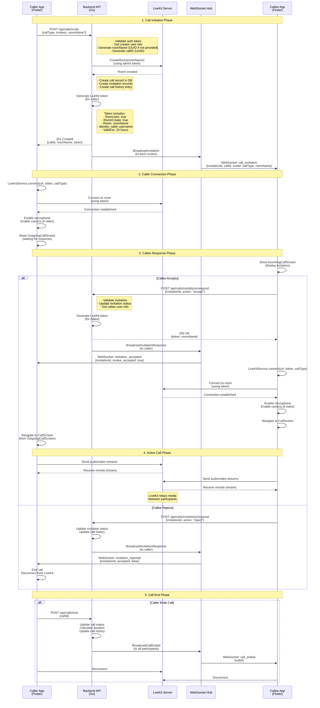

# Video Conference App

A Flutter mobile application for video conferencing and VoIP calls using LiveKit server.

## Features

- Join video conference rooms
- Real-time video and audio communication
- Toggle camera and microphone
- Support for multiple participants
- Cross-platform (iOS and Android)

## Prerequisites

- Flutter SDK (>=3.0.0)
- Docker and Docker Compose
- iOS: Xcode (for iOS development)
- Android: Android Studio (for Android development)

## Setup

### 1. Start LiveKit Server

Start the LiveKit server using Docker Compose:

```bash
docker-compose up -d
```

The LiveKit server will be available at:
- WebSocket: `ws://localhost:7880`
- HTTP: `http://localhost:7880`

### 2. Install Flutter Dependencies

```bash
flutter pub get
```

### 3. Run the App

For iOS:
```bash
flutter run -d ios
```

For Android:
```bash
flutter run -d android
```

## Configuration

The app is configured to connect to the local LiveKit server with default credentials:
- URL: `ws://localhost:7880`
- API Key: `devkey`
- API Secret: `secret`

For production, update these values in `lib/screens/home_screen.dart` and use environment variables or a secure token generation service.

## Usage

1. Launch the app
2. Enter a room name (e.g., "meeting-room-1")
3. Enter your name
4. Tap "Join Room"
5. Use the controls at the bottom to:
   - Toggle microphone (mute/unmute)
   - Toggle camera (on/off)
   - End call

## Project Structure

```
lib/
├── main.dart                 # App entry point
├── screens/
│   ├── home_screen.dart      # Home screen with room join form
│   └── video_call_screen.dart # Video call interface
├── services/
│   └── livekit_service.dart  # LiveKit connection service
└── utils/
    └── token_generator.dart  # JWT token generator for LiveKit
```

## Docker Compose Services

- **livekit**: LiveKit server for real-time communication
- **redis**: Redis instance for LiveKit state management

## Notes

- For testing on physical devices, update the LiveKit URL to your machine's IP address (e.g., `ws://192.168.1.100:7880`)
- Ensure your device and server are on the same network or configure proper network settings
- Camera and microphone permissions are required and will be requested on first use

## Troubleshooting

- If connection fails, ensure the LiveKit server is running: `docker-compose ps`
- Check server logs: `docker-compose logs livekit`
- For Android emulator, use `10.0.2.2` instead of `localhost`
- For iOS simulator, `localhost` should work

## Call Flow Diagram

The following diagram illustrates the complete flow of how a call is initiated, from the caller starting the call to both participants connecting to LiveKit:



### Key Components

1. **Token Generation**: The backend generates JWT tokens using LiveKit's AccessToken API with:
   - `RoomJoin: true` - Permission to join the room
   - `RoomCreate: true` - Permission to create rooms (if needed)
   - `Room: <roomName>` - Specific room name
   - `Identity: <username>` - User identity in the room
   - `ValidFor: 24 hours` - Token expiration

2. **Room Creation**: The backend automatically creates the LiveKit room before generating tokens, ensuring the room exists when participants connect.

3. **WebSocket Communication**: Real-time notifications for:
   - Call invitations
   - Invitation responses (accept/reject)
   - Call ended events
   - Call cancelled events

4. **LiveKit Connection**: Both participants use their respective tokens to connect directly to the LiveKit server, which handles all media routing and relay.

## License

This project is for development purposes.
